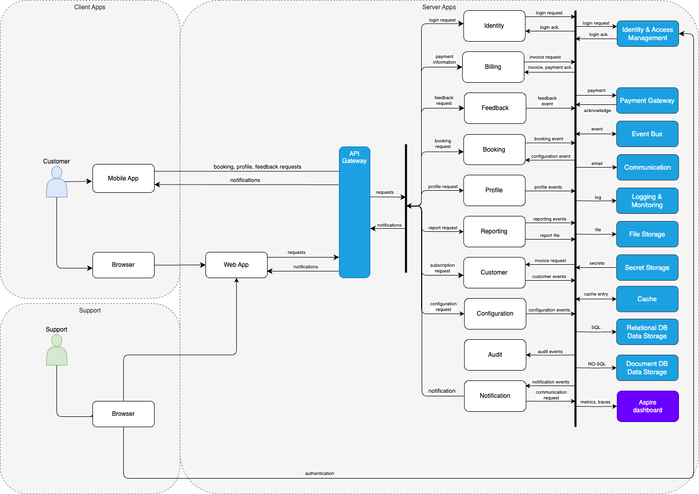
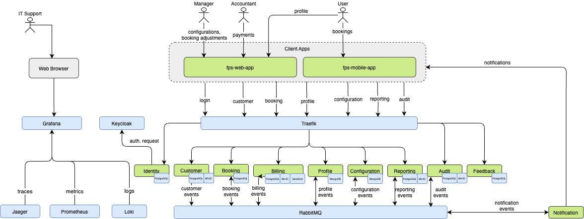

## Application Components

| App. Component | Description | Confidentiality | Integrity | Availability | Traceability |
| --------------------- | ----------- | --------------- | --------- | ------------ | ------------ |
| [Web App](./application-layer/web-app) | User interface for web users | Internal | Standard | High | Simple |
| [Mobile App](./application-layer/mobile-app) | User interface for mobile users | Internal | Standard | High | Simple |
| [Identity](./application-layer/identity) | Authentication features | Internal | High | High | Simple |
| [Audit](./application-layer/audit) | Manage and retrieve audit logs | Internal | High | High | Detailed |
| [Billing](./application-layer/billing) | Manage customer billing and invoicing | Confidential | High | High | Simple |
| [Booking](./application-layer/booking) | Manage booking requests and allocations | Internal | High | High | Simple |
| [Configuration](./application-layer/configuration) | Manage configuration options | Internal | Standard | High | Simple |
| [Customer](./application-layer/customer) | Manage customer information and invoicing | Confidential | High | High | Simple |
| [Feedback](./application-layer/feedback) | Manage user feedback | Internal | Standard | High | Simple |
| [Notification](./application-layer/notification) | Manage and send notifications | Internal | Standard | High | Simple |
| [Profile](./application-layer/profile) | Manage customer users and profiles | Confidential | High | High | Simple |
| [Reporting](./application-layer/reporting) | Generate and retrieve reports | Internal | Standard | High | Simple |
| [Aspire Dashboard](https://learn.microsoft.com/en-us/dotnet/aspire/fundamentals/dashboard)[^1]| Development-time dashboard for monitoring cloud-native app metrics, logs and traces | Internal | Standard | High | Simple |

---

[^1] Aspire Dashboard is a software component providing another view on logs, traces and metrics, but it's deployed independently.
