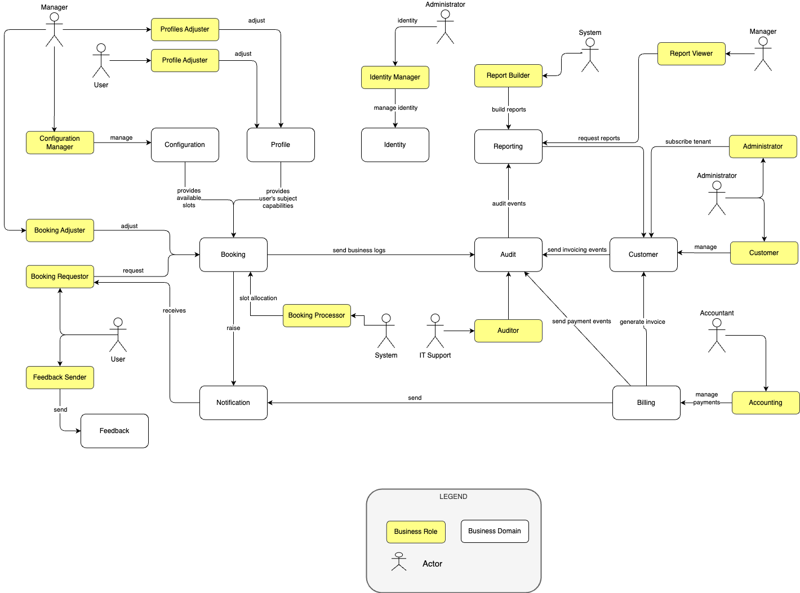

The business layer explains why FPS exists, who it serves, and which customer outcomes the product must deliver. It should be read before the application and technology layers because it defines the business problem, policy model, and value proposition.

## Business Value

FPS helps companies manage scarce parking capacity without turning HR into a manual dispatch team. The product creates value by:

- reducing email and spreadsheet-based administration;
- making parking allocation transparent and auditable;
- improving employee trust in a fair process;
- increasing utilization of existing parking assets;
- giving management usable data about demand, capacity, and policy impact.

## Core Documents

- [Stakeholders & Personas](./business-layer/personas)
- [Business & Technical Roles](./business-layer/roles)
- [Business Requirements](./business-layer/requirements)
- [Booking Vertical Slices](./business-layer/booking-vertical-slices)
- [Booking Request Lifecycle](./business-layer/booking-request-lifecycle)
- [Allocation Process](./business-layer/process)
- [Executable Allocation Rules](./business-layer/allocation-rules)
- [Parking Policy Configuration](./business-layer/parking-policy-configuration)
- [Business Strategy](./business-layer/strategy)
- [Functional Architecture](./business-layer/functional-architecture)

## Capability Areas

- [Booking](./business-layer/booking)
- [Profile](./business-layer/profile)
- [Customer](./business-layer/customer)
- [Identity](./business-layer/identity)
- [Configuration](./business-layer/configuration)
- [Notification](./business-layer/notification)
- [Reporting](./business-layer/reporting)
- [Audit](./business-layer/audit)
- [Billing](./business-layer/billing)
- [Feedback](./business-layer/feedback)
- [Web App](./business-layer/web-app)
- [Mobile App](./business-layer/mobile-app)

## Exchange Map

