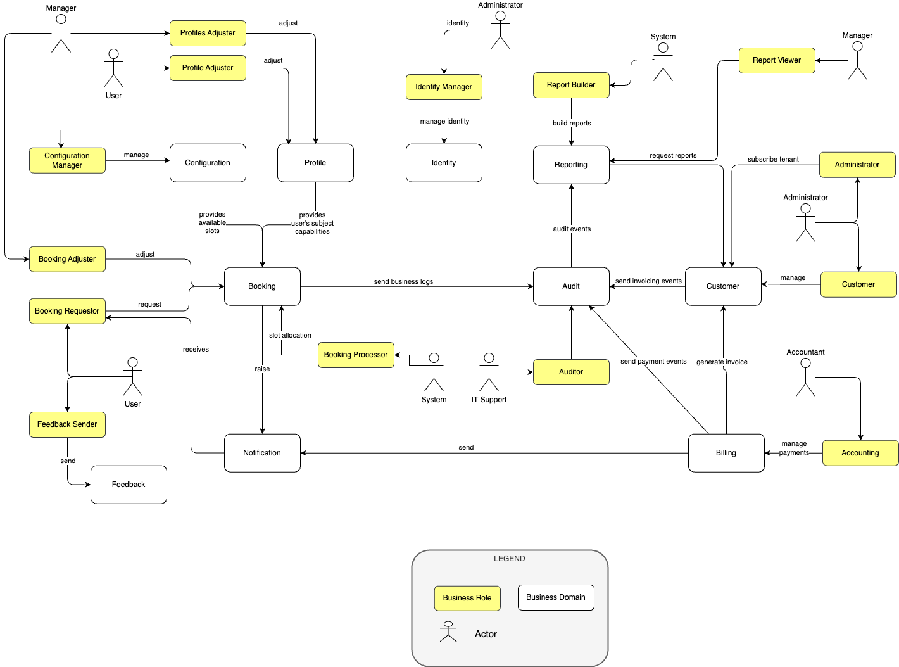

# Business Layer

The business layer explains why FairSpot exists, who it serves, and which customer outcomes the product must deliver. It should be read before the application and technology layers because it defines the business problem, policy model, and value proposition.

## Business Value

FairSpot helps customer organizations manage scarce shared capacity without turning operators into a manual dispatch team. Parking is the current proof path. The product creates value by:

- reducing email and spreadsheet-based administration;
- making allocation transparent and auditable;
- improving user trust in a fair process;
- increasing utilization of existing scarce capacity;
- giving management usable data about demand, capacity, and policy impact.

## Core Documents

- [Stakeholders & Personas](./business-layer/personas)
- [Role Intent Roadmap](./business-layer/role-intent-roadmap)
- [Business & Technical Roles](./business-layer/roles)
- [Business Requirements](./business-layer/requirements)
- [Booking Event Contracts](./business-layer/booking-event-contracts)
- [Booking Authorization](./business-layer/booking-authorization)
- [Booking Reason Codes](./business-layer/booking-reason-codes)
- [Booking API Contract](./business-layer/booking-api-contract)
- [Booking Context Contract](./business-layer/booking-context-contract)
- [Booking Request Lifecycle](./business-layer/booking-request-lifecycle)
- [Module Reservations UX](./business-layer/module-reservations-ux)
- [My Spots Employee UX](./business-layer/my-spots-ux)
- [Business Process Flows](./business-layer/business-process-flows)
- [Allocation Process](./business-layer/process)
- [Executable Allocation Rules](./business-layer/allocation-rules)
- [Parking Policy Configuration](./business-layer/parking-policy-configuration)
- [Customer Identity Integration](./business-layer/customer-data-import)
- [Tenant Discovery and Login Modes](./business-layer/tenant-login-modes)
- [Tenant Onboarding](./business-layer/tenant-onboarding)
- [Platform Operator Dashboard UX](./business-layer/platform-dashboard-ux)
- [Business Strategy](./business-layer/strategy)
- [Functional Architecture](./business-layer/functional-architecture)
- [DataHub Application](./application-layer/datahub)

## Capability Areas

- [Booking](./business-layer/booking)
- [Profile](./business-layer/profile)
- [Customer](./business-layer/customer)
- [DataHub](./application-layer/datahub)
- [Identity](./business-layer/identity)
- [Configuration](./business-layer/configuration)
- [Notification](./business-layer/notification)
- [Reporting](./business-layer/reporting)
- [Audit](./business-layer/audit)
- [Billing](./business-layer/billing)
- [Feedback](./business-layer/feedback)
- [Web App](./business-layer/web-app)
- [Mobile App](./business-layer/mobile-app)

## Exchange Map

Validation note: [Exchange Map Validation](./exchange-map-validation)
