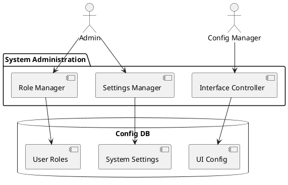
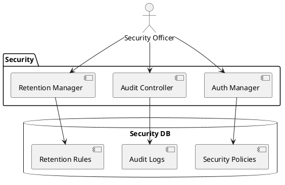
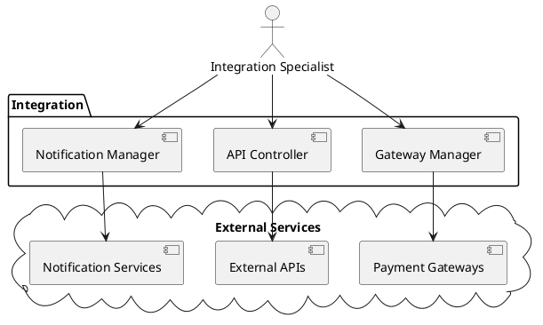

## Overview

[Configuration module](../application-layer/configuration) provides comprehensive system configuration capabilities. It enables administrators and users to customize and manage various system aspects based on their roles and permissions.

Parking-specific tenant and location policy requirements are defined in [Parking Policy Configuration](./parking-policy-configuration). That document is the implementation contract for cut-off times, request caps, lookback windows, penalties, usage confirmation, company-car behavior, and location overrides.

## Business Interfaces

### Administrative Interface
- **Primary Actors:** System Administrators
- **Functions:**
    - System settings management
    - User role configuration
    - Security policy administration
    - Compliance control

### User Configuration Interface
- **Primary Actors:** End Users
- **Functions:**
    - Personal preferences
    - Interface customization
    - Notification settings

### Integration Management Interface
- **Primary Actors:** Integration Specialists
- **Functions:**
    - Payment gateway setup
    - API configuration
    - Third-party service management

## Roles and Responsibilities

### System Administrator
- Complete system configuration access
- Security policy management
- User role administration
- Compliance monitoring

### Configuration Manager
- System settings management
- Interface customization
- Localization control
- Integration setup

### Security Officer
- Authentication configuration
- Audit trail management
- Data retention policies
- Compliance verification

### Integration Specialist
- Payment gateway configuration
- API connection management
- External service integration
- Notification system setup

## Configuration Services

### System Administration Service
- System settings management
- User role administration
- Interface customization
- Localization control

### Security Service
- Authentication management
- Audit configuration
- Data retention control

### Integration Service
- Payment gateway management
- API connection control
- Notification system configuration

### Compliance Service
- Audit management
- Data protection control
- Security compliance verification

## Service Diagrams

### System Administration

### Security Management

### Integration Management

