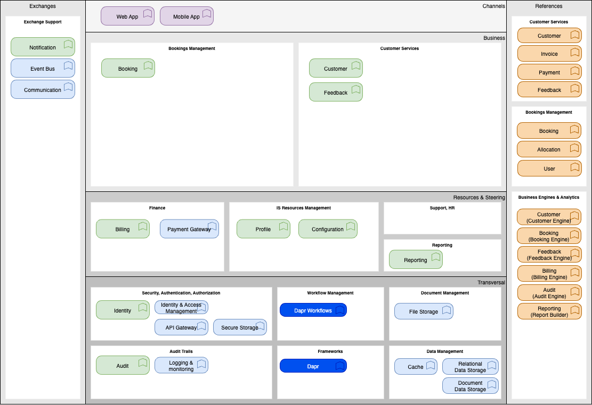

## Overview

The functional architecture of the Fair Parking System (FPS) is designed to ensure equitable distribution of parking slots among employees. Employers can send requests to park their vehicles, and the system distributes available slots using a daily draw process. This process prioritizes employees with fewer parking requests, increasing their chances of securing a slot. This approach ensures fairness and maximizes the utilization of available parking spaces.

## Function Map

### [Identity](./identity)

  - **User Authentication**: Provides secure login mechanisms including username/password and multi-factor authentication.
  - **Password Management**: Allows users to reset and change passwords securely.
  - **Session Management**: Manages user sessions to ensure security and prevent unauthorized access.
  - **Single Sign-On (SSO)**: Supports SSO for seamless access across multiple systems.
  - **Account Lockout**: Implements account lockout policies to protect against brute force attacks.
  - **Login Activity Monitoring**: Tracks and logs login activities for security auditing.
  - **Captcha Integration**: Integrates captcha to prevent automated login attempts.
  - **Social Media Login**: Supports login via social media accounts for user convenience.
  - **Two-Factor Authentication (2FA)**: Provides an additional layer of security through 2FA.
  - **Biometric Authentication**: Supports biometric authentication methods such as fingerprint and facial recognition.

### [Profile](./profile)

- **Update Personal Information**: Allows users to update their personal details to keep their profile current.
- **View Booking History**: Enables users to view their past booking history for tracking reservations.
- **Provide Vehicle Information**: Allows users to add and update their vehicle information.
- **Manage Active Sessions**: Enables users to manage their active sessions for account security.
- **Enable Multi-factor Authentication**: Provides users with the option to enable multi-factor authentication for enhanced security.
- **View Login History**: Allows users to view their login history to monitor account access.
- **Access Customer Support**: Provides users with access to customer support for assistance with issues.
- **Receive Notifications**: Ensures users receive notifications for important events.
- **Provide Feedback**: Allows users to provide feedback to help improve the service.
- **Ensure Data Security**: Implements measures to protect user data with strong encryption and privacy protocols.

### [Bookings](./booking)

  - **Submit Booking Requests**: Users can submit booking requests to reserve parking slots, specifying time, duration, and any specific requirements.
  - **View Booking Status**: Users can check the status of their booking requests, including pending, confirmed, or denied.
  - **Cancel Booking**: Users can cancel their booking requests if their plans change.
  - **Modify Booking**: Users can modify the details of their existing booking requests.
  - **Get Available Slots**: Users can view available parking slots for a given time frame.
  - **Confirm Slot Usage**: Users can confirm the usage of their allocated parking slots.
  - **Booking History**: Users can view their past booking history.
  - **Submit Feedback**: Users can submit feedback on the booking process.
  - **Allocate Slots**: The system allocates parking slots based on booking requests.
  - **Notify Users**: The system notifies users about their booking status and slot allocation.
  - **Log Draw Process**: The system logs all steps of the draw process for transparency.
  - **Gather User Feedback**: The system collects user feedback on the draw process.
  - **Manual Override**: Authorized personnel can manually override the draw process with proper justification.
  - **Log Conflict Resolution**: The system logs all conflict resolution activities.
  - **Handle System Errors**: The system detects and corrects errors during the draw process.
  - **Document Draw Process**: The system provides comprehensive documentation of the draw process.
  - **Confirm Slot Allocation**: Users can confirm their parking slot allocation upon entering the garage.
  - **Send Automated Notifications**: The system sends automated notifications to users confirming their parking slot usage.
  - **Collect Usage Data**: The system collects data on parking slot usage patterns.
  - **Future Optimization Support**: The system may later use advanced analytics to improve allocation decisions once the core workflow is trusted.
  - **Demand Forecasting**: The system may forecast parking demand from historical request and usage data.
  - **Dynamic Policy Tuning**: The system may recommend policy adjustments based on current capacity, demand, and utilization patterns.
  - **Behavior Pattern Analysis**: The system may analyze repeated cancellations, no-shows, and request patterns to support fairer policy decisions.
  - **Anomaly Detection**: The system may detect unusual booking patterns that require HR or support review.
  - **Personalized Guidance**: The system may suggest better request times or alternative parking options based on user history and availability.
  - **Ensure Data Privacy Compliance**: The system ensures data privacy compliance.
  - **Monitor System Performance**: The system monitors performance during the draw process.
  - **Ensure Scalability**: The system ensures the draw process is scalable.
  - **Handle Cancellations and Modifications**: The system handles booking cancellations and modifications efficiently.

### [Billing and Payments](./billing)

  - **Secure Transactions**: Ensures all financial transactions are encrypted and secure, protecting user data and preventing fraud.
  - **Multiple Payment Methods**: Supports various payment methods including credit/debit cards, digital wallets, and bank transfers to provide flexibility to users.
  - **Payment Gateway Integration**: Seamlessly integrates with multiple payment gateways to facilitate smooth and reliable payment processing.
  - **Automated Billing**: Automates the billing process to reduce manual effort and minimize errors, ensuring timely and accurate invoicing.
  - **Customizable Invoices**: Allows customization of invoices to include company branding, detailed breakdowns, and personalized messages.
  - **Real-time Reporting**: Provides real-time financial reports to track transactions, revenue, and other key metrics for informed decision-making.
  - **Tenant-specific Payment Settings**: Offers configurable payment settings tailored to the needs of different tenants or user groups.
  - **Subscription Models**: Supports various subscription models, enabling recurring billing and management of subscription plans.
  - **Payment Notifications**: Sends automated notifications to users for payment confirmations, due dates, and other important updates.
  - **Refund Processing**: Facilitates easy and efficient processing of refunds, ensuring customer satisfaction and compliance with policies.
  - **Transaction History**: Maintains a comprehensive history of all transactions for record-keeping and auditing purposes.
  - **Dispute Resolution**: Provides mechanisms for resolving payment disputes, ensuring fair and transparent handling of issues.

### [Reporting](./reporting)

  - **Real-time Occupancy Reports**: Provides current status of parking space occupancy, displaying available and occupied spaces in real-time.
  - **Historical Usage Reports**: Tracks historical data on parking space usage, generating reports for specific time periods to analyze trends.
  - **Revenue Reports**: Summarizes revenue generated from parking fees, breaking down revenue by day, week, month, or custom date ranges.
  - **Violation Reports**: Logs parking violations and fines issued, providing detailed reports on types and frequency of violations.
  - **User Activity Reports**: Monitors user activity within the parking system, reporting on user registrations, logins, and parking sessions.
  - **Maintenance Reports**: Generates reports on maintenance activities and schedules, including data on scheduled and completed tasks.
  - **Customer Feedback Reports**: Collects and generates reports on customer feedback and satisfaction, including ratings and comments.
  - **Requests History Reports**: Generates reports on the history of requests with various filters, including date, user, and license plate.
  - **User Request vs. Assignment Reports**: Generates graphical reports comparing user requests and assignments, including a graph comparing the number of requests and assignments per user.
  - **Most Active User Reports**: Generates reports on the most active users based on requests and assignments, including data on the number of requests and assignments per user.
  - **Least Active User Reports**: Generates reports on the least active users based on requests and assignments, including data on the number of requests and assignments per user.
  - **Parking Slot Utilization Reports**: Generates reports on parking slot utilization with various filters, including data on occupancy rates and usage patterns.
  - **System Error Logs and Incident Reports**: Generates reports on system error logs and incidents, including details on error types and resolutions.
  - **User Login History and Active Sessions Reports**: Generates reports on user login history and active sessions, including data on login times and session durations.
  - **Two-Factor Authentication Usage Reports**: Generates reports on two-factor authentication usage statistics, including data on authentication attempts and success rates.
  - **Third-Party Integration Usage Reports**: Generates reports on third-party integration usage and performance, including data on integration usage and performance metrics.
  - **System Backup and Recovery Reports**: Generates reports on system backup and recovery operations, including details on backup and recovery activities.
  - **User Account Deletion Requests Reports**: Generates reports on user account deletion requests and their status, including data on deletion request statuses and processing times.

### [Customer](./customer)

  - **Customer Requirements**:
  Manages customer data, ensuring privacy and compliance, and offers tailored services.
  - **User Management**: Comprehensive user management features, including role-based access control, ensuring only authorized personnel can access sensitive data.
  - **Custom Reporting**: Ability to generate, save, and modify custom reports in various formats, with scheduling and automatic generation options.
  - **Billing and Payments**: Robust billing system supporting multiple payment methods, detailed invoices, and automated billing processes.
  - **Data Privacy and Security**: Secure storage and transmission of customer data, regular security audits, and timely breach notifications.
  - **Customer Support**: Dedicated support portal with multiple channels, tracking response and resolution times.
  - **Integration with Third-Party Services**: APIs for integration with third-party services, with documentation and support for API usage.

  For more details, refer to the [Customer](./customer) documentation.

### [Feedback](./feedback)

- **Submit Feedback**: Allows users to submit feedback about the application to help improve the user experience.
- **View Feedback**: Enables developers to view user feedback to understand user issues and suggestions.
- **Respond to Feedback**: Allows support team members to respond to user feedback, ensuring users feel heard and valued.
- **Feedback Dashboard**: Provides a dashboard for developers and support team members to view, filter, and manage feedback.
- **Feedback Categorization**: Categorizes feedback by type (e.g., bug report, feature request) for better organization and analysis.
- **Feedback Notifications**: Sends notifications to users when their feedback is responded to, keeping them informed.
- **Feedback Logging**: Logs all feedback and responses for future reference and analysis.

### [Audit](./audit)

- **Audit Trail**: Maintains a comprehensive audit trail of all user actions and system events for accountability and transparency.
- **Change Tracking**: Tracks changes to critical data, including who made the changes and when.
- **Compliance Reporting**: Generates reports to ensure compliance with regulatory requirements.
- **Data Integrity Checks**: Regularly checks data integrity to detect and prevent unauthorized modifications.
- **Access Logs**: Logs access to sensitive data and resources to monitor and prevent unauthorized access.
- **Audit Log Management**: Provides tools for managing and archiving audit logs securely.
- **Alerting and Notifications**: Sends alerts for suspicious activities detected in audit logs.

### [Notification](./notification)

- **Real-time Notifications**: Sends real-time notifications to users for important events and updates.
- **Customizable Notification Settings**: Allows users to customize their notification preferences and delivery methods.
- **Email Notifications**: Sends notifications via email for various events such as booking confirmations, payment receipts, and system alerts.
- **SMS Notifications**: Provides SMS notifications for urgent alerts and reminders.
- **Push Notifications**: Supports push notifications for mobile app users to keep them informed on the go.
- **In-app Notifications**: Displays notifications within the application for seamless user experience.
- **Notification History**: Maintains a history of all notifications sent to users for reference and auditing purposes.
- **Event-based Triggers**: Configures notifications based on specific events or conditions within the system.
- **Notification Templates**: Allows customization of notification templates to include branding and personalized messages.
- **Batch Notifications**: Supports sending batch notifications for bulk updates and announcements.
- **Notification Analytics**: Provides analytics on notification delivery and engagement to optimize communication strategies.

### User Interface

- **[UI Requirements](./ui):**
  - Ensures modular and reusable UI components adhering to design principles and accessibility standards.

  #### [Web App](./web-app)

  - **Responsive Design**: Adapts seamlessly to different screen sizes and devices.
  - **Cross-browser Support**: Functions consistently across major web browsers.
  - **Progressive Loading**: Implements progressive loading for improved performance.
  - **Offline Capabilities**: Provides basic functionality when offline.
  - **SEO Optimization**: Ensures content is optimized for search engines.
  - **Accessibility Features**: Complies with WCAG guidelines.
  - **Session Management**: Handles user sessions securely.

#### [Mobile App](./mobile-app)

  - **Native Performance**: Optimized for iOS and Android platforms.
  - **Push Notifications**: Real-time alerts and updates.
  - **Offline Mode**: Core functionality available without internet.
  - **Biometric Authentication**: Supports fingerprint and face recognition.
  - **Location Services**: GPS integration for parking guidance.
  - **Camera Integration**: Scan QR codes and parking tickets.
  - **Battery Optimization**: Minimizes battery consumption.
