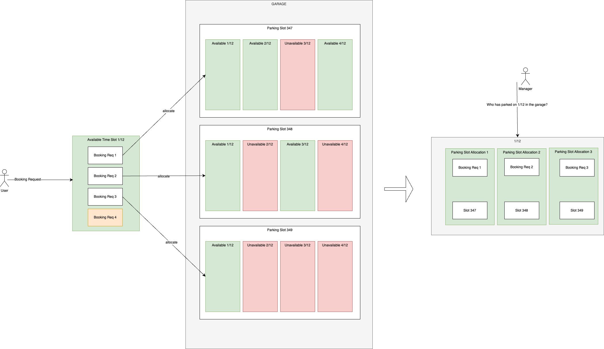

## Purpose

FPS must allocate limited parking capacity in a way that employees and managers can understand and trust. Because demand can exceed supply, the system cannot rely only on first-come, first-served booking. The allocation process must balance fairness, policy, and practical use of available spaces.

The business goal is simple: employees should have a fair opportunity to park, HR should not manually arbitrate every request, and the company should use its parking assets efficiently.

## Business Principles

### Fairness

Employees who have received fewer recent allocations should have a better chance in future draws. The system should avoid patterns where the same employees repeatedly receive spaces while others are consistently rejected.

### Transparency

Allocation rules must be explainable. HR and employees should be able to understand why a request was allocated, rejected, or deprioritized.

### Policy Control

Each customer must be able to configure local rules, including reserved spaces, company cars, motorcycles, EV charging, accessibility requirements, time slots, and penalties.

### Low Administration

The normal process should run without HR manually reviewing every request. Manual intervention should be limited to exceptions and should always be auditable.

### Efficient Utilization

Spaces released by cancellations, unused reservations, or company-car absences should be made available to other eligible employees whenever policy allows it.

## Allocation Model

FPS uses a weighted allocation model. Each eligible request receives a priority weight based on configurable business factors. A higher weight gives the request a better chance of receiving an available space.

The implementation contract for Draw behavior is documented in [Executable Allocation Rules](./allocation-rules).

Typical factors include:

- Recent successful allocations.
- Late cancellations or no-shows.
- Employee eligibility.
- Vehicle type and space capability.
- Reserved-space or company-car rules.
- Customer-specific priority rules.

The default fairness rule should favor employees who have parked less often recently. This keeps the process fair over time without requiring HR to manually compare every employee.

## Default Fairness Rule

A simple starting rule is:

```text
Tier2Weight = 1 / (1 + RecentAllocationCount + ActivePenaltyScore)
```

`RecentAllocationCount` is the number of successful non-company-car allocations for the requestor in the tenant's configured lookback window.
`ActivePenaltyScore` is the active penalty total from late cancellations, no-shows, policy violations, or justified manual HR adjustments.

The lookback window is tenant-configurable and defaults to `10` days. Same-day successful allocations count toward `RecentAllocationCount` because they consume scarce parking capacity. Tier 1 company-car allocations do not count toward Tier 2 weight.

This means:

- employees with fewer previous allocations receive a higher chance;
- penalties reduce future chances;
- every eligible employee still has some chance unless policy excludes the request.

Rejected requests are not part of the default denominator. They remain useful for reporting and future fairness analysis, but adding them to the denominator would reduce the chance of employees who were already unlucky.

The exact formula can evolve, but the business principle should remain stable: allocation history and policy behavior influence future probability.

## Future Time Slot Process

This process covers requests submitted before the allocation draw for a future time slot.

The request status model is defined in [Booking Request Lifecycle](./booking-request-lifecycle).

1. The employee submits a parking request.
2. FPS validates the request against tenant policy.
3. FPS rejects duplicates or ineligible requests with a clear reason.
4. Valid requests wait in the allocation queue.
5. At the configured time, FPS locks the target time slot for allocation.
6. FPS applies reserved-space, vehicle, capacity, and fairness rules.
7. FPS allocates available spaces.
8. FPS notifies employees of the result.
9. FPS records the decision for reporting and audit.

## Same-Day Request Process

This process covers requests made after the scheduled allocation has already run.

1. The employee submits a same-day request.
2. FPS checks whether the request is eligible and whether capacity remains.
3. If a suitable space is available, FPS allocates it immediately according to tenant policy.
4. If no suitable space is available, FPS rejects the request or adds it to a waitlist.
5. FPS notifies the employee of the result.

Same-day allocation should be fast, but it must not bypass core policy. It should only use capacity that is genuinely available.

## Reserved and Company-Car Spaces

Some customers reserve spaces for company cars, executives, accessibility needs, or operational roles. FPS should support these rules without hiding unused capacity.

Business rules:

- Reserved users may keep priority access to assigned spaces.
- Reserved users should still declare when they need or do not need the space.
- Released reserved spaces can be offered to other eligible employees.
- Company-car requests may be exempt from penalties where customer policy requires it.
- If company-car requests exceed available matching capacity, FPS rejects the overflow requests for now. This is expected to be rare and keeps the first implementation simple.
- All reserved-space decisions should be visible in reports and audit history.

## Cancellations and Reallocation

Employees can cancel requests or reservations when their plans change.

Detailed status transitions and penalty triggers are defined in [Booking Request Lifecycle](./booking-request-lifecycle).

Before allocation:

- the request is removed from the allocation queue;
- no penalty is applied unless customer policy says otherwise.

After allocation:

- the reservation is cancelled;
- FPS may apply a late-cancellation penalty;
- the released space is automatically allocated to the next eligible requestor when one exists.

If the employee does not use an allocated space and usage confirmation is available, FPS may mark the reservation as a no-show and apply the configured policy.

## Penalties and Manual Adjustments

Penalties should encourage responsible use of limited capacity, not punish legitimate changes. Customers should configure when penalties apply and how long they affect allocation probability.

Examples:

- late cancellation after the draw;
- confirmed reservation not used;
- repeated policy violations;
- manual correction after an HR review.

Authorized roles may apply manual adjustments, but every adjustment must include a reason and be available for audit.

## Usage Confirmation

Usage confirmation improves fairness and reporting. FPS should support one or more confirmation methods depending on customer infrastructure.

Possible methods:

- employee self-confirmation in the web or mobile app;
- QR code scan;
- card reader or access-control integration;
- license plate recognition;
- manual confirmation by an authorized role.

Confirmed usage helps the customer identify unused allocations, improve fairness scoring, and measure real utilization.

## Example Allocation

Assume five employees request parking and three spaces are available. Employees with fewer recent allocations receive higher priority. FPS applies configured constraints first, such as vehicle type and reserved-space rules, then runs the fairness allocation across the remaining eligible requests.

The result is not meant to guarantee everyone a space every week. It is meant to prevent persistent unfairness over time and to give HR a defensible process.



## Further Improvements

Future policy extensions may include:

- percentage advantages for carpooling or eco-friendly commuting;
- shared motorcycle capacity rules;
- demand forecasting;
- waitlist optimization;
- integration with workplace calendars and building access systems.

These extensions should be evaluated against the same business principles: fairness, transparency, policy control, low administration, and efficient utilization.
