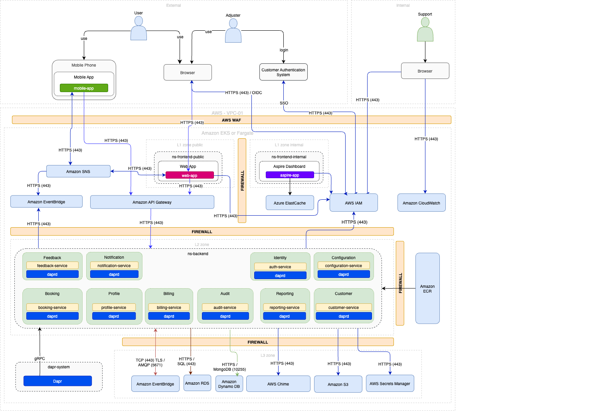

### Amazon AWS

The most expensive component in the AWS services list is **Amazon EKS** with an estimated price of ~$33.58 per month. A cheaper alternative could be **AWS Fargate**, which provides serverless compute for containers at a lower cost.

Here is the updated content:

| Service                         | Description / Purpose | Cheapest Region | Minimum Configuration | Estimated Price (per month) |
| ------------------------------- | --------------------- | --------------- | --------------------- | --------------------------- |
| AWS IAM                         | Identity and access management service for secure access to resources | US East (N. Virginia) | Free Tier | Free |
| AWS Fargate                     | Serverless compute for containers | US East (N. Virginia) | 1 vCPU, 2 GB memory | ~$20.00 |
| Amazon CloudWatch               | Full-stack monitoring service for applications and infrastructure | US East (N. Virginia) | 5 GB data ingestion | ~$24.24 |
| Amazon API Gateway              | API Management service for publishing, securing, and analyzing APIs | US East (N. Virginia) | 1 million requests | ~$3.50 |
| Amazon DynamoDB                 | Fully managed NoSQL database service | US East (N. Virginia) | Free Tier | Free |
| Amazon RDS                      | Managed relational database service with support for multiple database engines | US East (N. Virginia) | db.t3.micro, 20 GB storage | ~$15.79 |
| Amazon EventBridge              | Event routing service for building event-driven architectures | US East (N. Virginia) | 100,000 events | ~$1.00 |
| Amazon SNS                      | Simple Notification Service for sending messages to distributed systems | US East (N. Virginia) | 1 million requests | ~$0.50 |
| Amazon Chime                    | Communication APIs for voice, video, chat, and SMS | US East (N. Virginia) | Pay-as-you-go | Varies |
| AWS Secrets Manager             | Securely store and manage sensitive information such as keys, secrets, and certificates | US East (N. Virginia) | 1 secret | ~$0.40 |
| Amazon S3                       | Scalable object storage for unstructured data such as text or binary data | US East (N. Virginia) | 100 GB, Standard | ~$2.30 |
| AWS CodePipeline                | Continuous integration and delivery service for fast and reliable application updates | US East (N. Virginia) | 1 active pipeline | ~$1.00 |
| AWS VPC                         | Provides an isolated and secure network for your AWS resources | Basic configuration | ~$0.00 (included with other services) |
| AWS Elastic Load Balancer       | Distributes incoming network traffic across multiple instances | Basic SKU | ~$18.00 |
| AWS Backup                      | Backup service for protecting data and applications | 100 GB | ~$5.00 |
| AWS Route 53                    | Scalable DNS and domain name registration service | Basic configuration | ~$0.50 per hosted zone |
| AWS WAF                         | Protects web applications from common web exploits | Basic configuration | ~$5.00 per web ACL |
| AWS Shield                      | DDoS protection service | Standard | Free |
| AWS Direct Connect              | Dedicated network connection to AWS | Basic configuration | ~$0.30 per GB |
| AWS Elastic IP                  | Static IP addresses for dynamic cloud computing | 1 IP | ~$3.60 |
| Amazon ECR                      | Fully managed container registry for storing, sharing, and deploying container images | US East (N. Virginia) | 500 MB storage | ~$0.10 |
| Amazon ElastiCache              | Managed caching service for Redis or Memcached | US East (N. Virginia) | cache.t3.micro | ~$15.00 |

**Total Estimated Price (AWS):** ~$151.71
