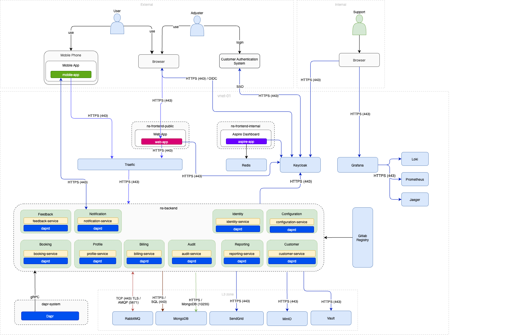

### Open Source solutions

| Tool/Framework | Version | Language | Distribution Format | License | Purpose | Docker Image Source |
| ---------------| ------- | -------- | ------------------- | ------- | ------- | ------------------- |
| Keycloak       | 15.0.2  | Java     | Docker image        | Apache 2.0 | Open-source identity and access management | [Docker Hub](https://hub.docker.com/r/jboss/keycloak) |
| Prometheus     | 2.26.0  | Go       | Docker image        | Apache 2.0 | Monitoring and alerting toolkit | [Docker Hub](https://hub.docker.com/r/prom/prometheus) |
| Grafana        | 7.5.5   | Various  | Docker image        | AGPL 3.0 | Open-source analytics and monitoring platform | [Docker Hub](https://hub.docker.com/r/grafana/grafana) |
| Loki           | 2.2.1   | Go       | Docker image        | AGPL 3.0 | Log aggregation system designed for efficiency and scalability | [Docker Hub](https://hub.docker.com/r/grafana/loki) |
| Jaeger         | 1.22.0  | Go       | Docker image        | Apache 2.0 | Distributed tracing system for monitoring and troubleshooting microservices | [Docker Hub](https://hub.docker.com/r/jaegertracing/all-in-one) |
| PostgreSQL     | 13.3    | SQL      | Docker image        | PostgreSQL | Advanced open-source relational database | [Docker Hub](https://hub.docker.com/_/postgres) |
| MongoDB        | 4.4.6   | Various  | Docker image        | SSPL    | NoSQL database for high volume data storage | [Docker Hub](https://hub.docker.com/_/mongo) |
| RabbitMQ       | 3.8.16  | Various  | Docker image        | MPL 1.1 | Message broker for asynchronous communication | [Docker Hub](https://hub.docker.com/_/rabbitmq) |
| Redis          | 6.2.5   | Various  | Docker image        | BSD 3-Clause | In-memory data structure store, used as a database, cache, and message broker | [Docker Hub](https://hub.docker.com/_/redis) |
| Traefik        | 2.4.8   | Go       | Docker image        | MIT     | Edge router for managing microservices and APIs | [Docker Hub](https://hub.docker.com/_/traefik) |
| MinIO          | 2023-10-10 | Go       | Docker image        | AGPL 3.0 | High-performance, S3 compatible object storage | [Docker Hub](https://hub.docker.com/r/minio/minio) |
| Vault          | 1.7.0   | N/A      | Docker image           | MPL 2.0 | Secret management and data protection tool | [Docker Hub](https://hub.docker.com/r/hashicorp/vault) |
