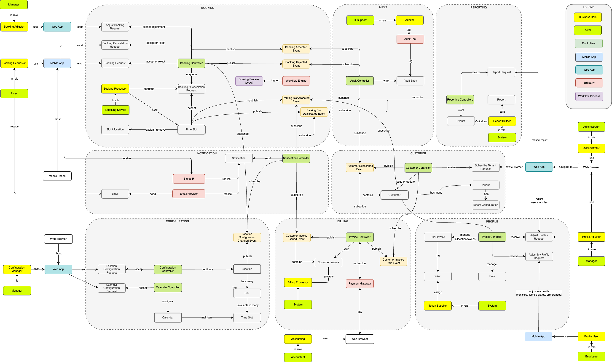

- [**Security**](./technology-layer/security): Implements security measures to protect data and ensure compliance with industry standards.
- [**Non-functional Requirements**](./technology-layer/non-functional-requirements): Addresses performance, reliability, usability, and other non-functional aspects.
- [**Software Architecture**](./technology-layer/software-architecture): Defines the structure and organization of the software components.
- [**Packaging**](./technology-layer/packaging): Manages the distribution and deployment of the application.
- [**Production**](./technology-layer/production): Ensures the application remains operational and up-to-date through regular updates and monitoring.

### Technologies Used

- **.NET 10**: Core framework for backend services.
- **React**: Frontend library for web user interfaces.
- **React Native + Expo**: Mobile platform.
- **Docker**: Containerization platform for consistent deployment.
- **Kubernetes**: Orchestration platform for managing containerized applications.
- **Dapr 1.14+**: Runtime for state, pub/sub, service invocation, sidecars, and future workflows.
- **RabbitMQ via Dapr pub/sub**: Event bus for Booking events consumed by Notification, Audit, and future read models.
- **MongoDB**: Dapr-backed write store and MongoDB-driver read store, isolated database-per-tenant.
- **Keycloak**: OIDC/OAuth 2.0 identity provider.

### Domain Map

