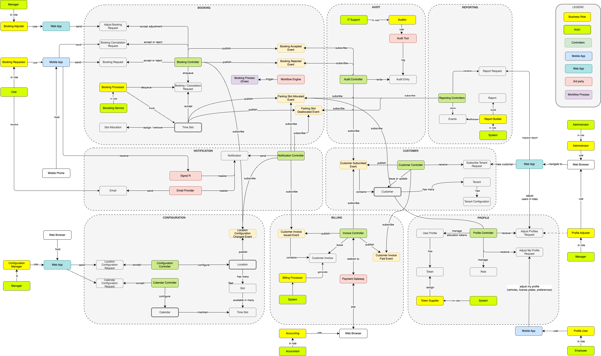

# Technology Layer

- [**Non-functional Requirements**](./technology-layer/non-functional-requirements): Addresses performance, reliability, usability, and other non-functional aspects.
- [**Software Architecture**](./technology-layer/software-architecture): Defines the structure and organization of the software components.
- [**Packaging**](./technology-layer/packaging): Manages the distribution and deployment of the application.

Security is a cross-cutting top-level section, not a child of the technology layer. See [Security](./security) for the FairSpot security model, controls, privacy requirements, and service-specific security notes.

Production operation is also a top-level architecture section. See [Production](./production) for the hosted runtime model, deployment path, backups, restore, monitoring, incidents, and readiness gates.

### Technologies Used

- **.NET 10**: Core framework for backend services.
- **React**: Frontend library for web user interfaces.
- **React Native + Expo**: Mobile platform.
- **Docker / containers**: Packaging and local runtime baseline.
- **Dapr 1.18+**: Provider-neutral runtime boundary for state, pub/sub, service invocation, sidecars, secrets, and future workflows.
- **Dapr pub/sub**: Event bus contract for Booking events consumed by Notification, Audit, Reporting, and future read models. The concrete broker is selected by deployment profile.
- **Dapr state store / persistence adapters**: Persistence boundary for service-owned state and read models. The concrete operational/document store is selected by deployment profile.
- **OIDC/OAuth 2.0 identity provider**: Identity boundary for JWT issuer, tenant/user claims, roles, and SSO. The concrete IdP is selected by local, demo, or client production profile.
- **OpenTelemetry**: Telemetry boundary for metrics, logs, traces, dashboards, and alerting. Client production exports to the client's approved observability platform.
- **Profile-specific deployment tooling**: Local, NAS/Cloudflare, DigitalOcean, Kubernetes, or client-owned environments may use different infrastructure-as-code and runtime tooling without changing application service contracts.

### Domain Map

