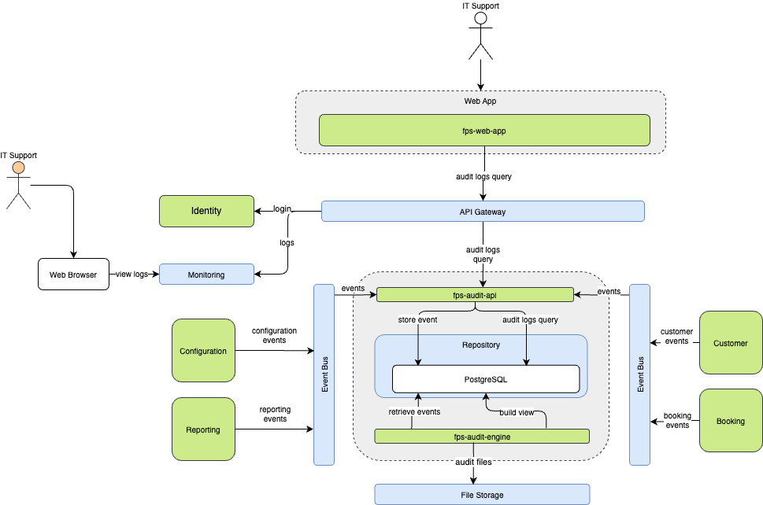
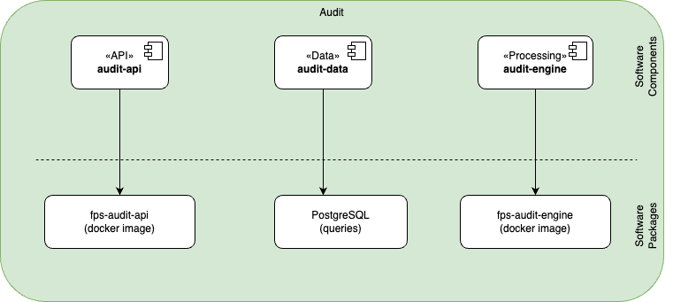

The Audit component is responsible for tracking and logging all significant actions and events within the system. This includes user activities, system changes, and access to sensitive data. It ensures accountability and provides a trail of evidence that can be used for security audits, compliance verification, and troubleshooting.

## Software Components

| Software Component | Type | Purpose | Technology |
|-------------------|------|----------|------------|
| audit-api | API | External interface for audit operations | Web API (REST + GraphQL) |
| audit-data | Data | Audit data access and persistence | Relational DB |
| audit-engine | Service | Core audit processing and logging | Web API |

## REST API Endpoints

| Endpoint | Method | Description | Status |
|----------|--------|-------------|---------|
| `/api/v1/audit/logs` | GET | Retrieve audit logs with optional filtering | 200, 400, 403 |
| `/api/v1/audit/logs/{id}` | GET | Get specific audit log entry by ID | 200, 404, 403 |
| `/api/v1/audit/logs` | POST | Create new audit log entry | 201, 400, 403 |
| `/api/v1/audit/reports` | GET | Generate audit reports | 200, 400, 403 |
| `/api/v1/audit/events` | GET | List audit event types | 200, 403 |
| `/api/v1/audit/users/{userId}/activity` | GET | Get user activity history | 200, 404, 403 |
| `/api/v1/audit/logs` | DELETE | Clear audit logs (restricted access) | 204, 403 |

## Service Exchanges

| Interface           | Consumer   | Producer   | No. of calls / day | Auth. method | Type / Protocol   | Comments |
|---------------------|------------|------------|--------------------|--------------|-------------------|----------|
| User Authentication | Consumer 1 | Producer 1 | 1000               | OAuth 2.0    | REST / HTTPS      |          |
| Interface 2         | Consumer 2 | Producer 2 | 500                | API Key      | SOAP / HTTPS      |          |
| Interface 3         | Consumer 3 | Producer 3 | 2000               | JWT          | GraphQL / HTTPS   |          |

## Message Exchanges

| Message Type       | Sender     | Receiver   | Frequency           | Format       | Protocol         | Comments |
|--------------------|------------|------------|---------------------|--------------|------------------|----------|
| Event Notification | Service A  | Service B  | Real-time           | JSON         | WebSocket        |          |
| Data Sync          | Service C  | Service D  | Every 5 minutes     | XML          | AMQP             |          |
| Alert Message      | Service E  | Service F  | On Event            | Plain Text   | MQTT             |          |

## File Exchanges

| File Name          | Source      | Destination | Frequency          | Format       | Transfer Method | Comments |
|--------------------|-------------|-------------|--------------------|--------------|-----------------|----------|
| User Data Export   | System A    | System B    | Daily              | CSV          | SFTP            |          |
| Transaction Logs   | System C    | System D    | Hourly             | JSON         | FTP             |          |
| Backup Archives    | System E    | System F    | Weekly             | ZIP          | HTTPS           |          |

## Packaging

