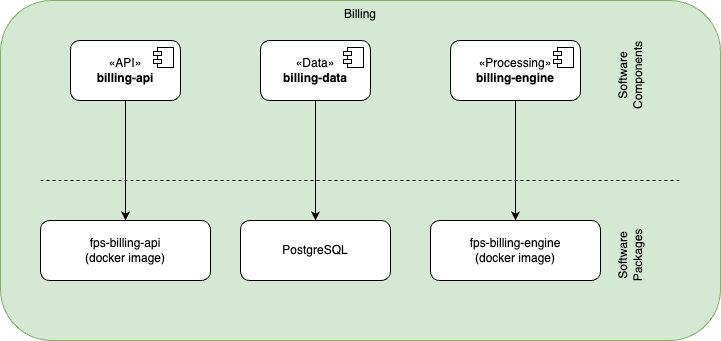

The Billing component is responsible for handling all financial transactions within the system. It ensures secure processing of payments, manages billing, and integrates with various payment gateways.

## REST API Endpoints

### Payment Methods

| Endpoint | Method | Purpose | Response | Status |
|----------|--------|---------|----------|---------|
| `/api/payment-methods` | GET | List available payment methods | Payment method array | 200 OK |
| `/api/payment-methods` | POST | Add new payment method | Created payment method | 201 Created |
| `/api/payment-methods/{id}` | DELETE | Remove payment method | No content | 204 No Content |

### Invoices

| Endpoint | Method | Purpose | Response | Status |
|----------|--------|---------|----------|---------|
| `/api/invoices` | GET | List all invoices | Invoice array | 200 OK |
| `/api/invoices/{id}` | GET | Get invoice details | Invoice object | 200 OK |
| `/api/invoices/generate` | POST | Generate new invoice | Created invoice | 201 Created |
| `/api/invoices/{id}/status` | PUT | Update invoice status | Updated invoice | 200 OK |

### Transactions

| Endpoint | Method | Purpose | Response | Status |
|----------|--------|---------|----------|---------|
| `/api/transactions` | GET | List all transactions | Transaction array | 200 OK |
| `/api/transactions/{id}` | GET | Get transaction details | Transaction object | 200 OK |
| `/api/transactions/refund` | POST | Process refund | Refund details | 200 OK |
| `/api/transactions/dispute` | POST | Create dispute | Dispute details | 201 Created |

## Software Components

| Software Component | Type | Purpose | Technology |
|-------------------|------|----------|------------|
| billing-api | API | External interface for customer billings and payments | Web API (REST) |
| billing-data | Data | Data access and persistence | Relational DB |
| billing-engine | Processing | Handles billing and invoice processing | Web API

## Packaging

