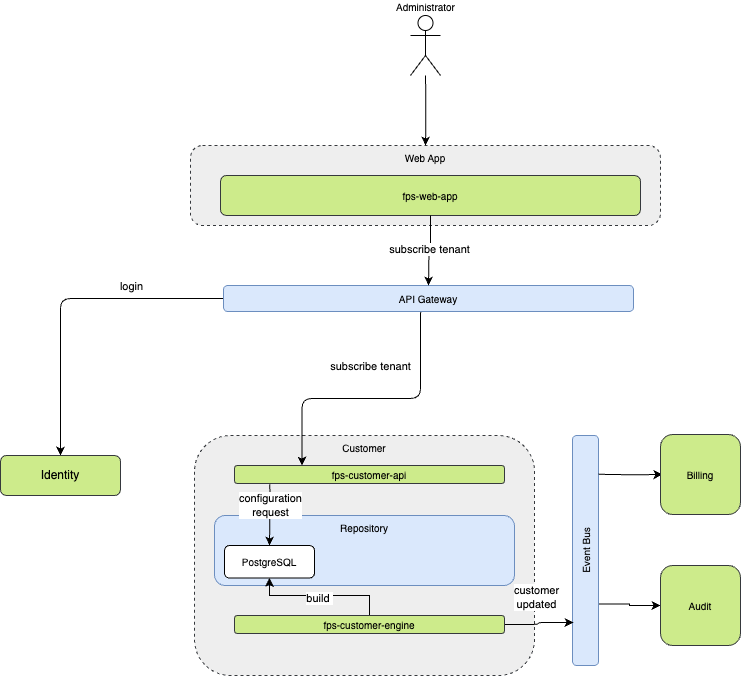

# Billing Technology

This page is a documentation-only guardrail. It does not approve product Billing implementation.

Billing technology is deferred. FairSpot currently has no active Billing service, financial collection API, invoice engine, or Billing data store. The commercialisation decision is documented in [Commercialisation Impact Review](../strategy-layer/commercialisation).

## Current Technology Boundary

| Area | Position |
| --- | --- |
| Billing API | Not implemented. |
| Billing service | Not implemented. |
| Commercial data store | Not created. |
| Invoice workflow | Deferred. |
| Subscription enforcement | Deferred. |
| Financial collection scope | Avoided by not processing financial collection data in FairSpot. |

## Future Technical Direction

If a future approved commercial model requires in-product Billing, start with tenant-scoped contract metadata instead of financial collection:

| Component candidate | Purpose | Notes |
| --- | --- | --- |
| Commercial account API | Read/update tenant commercial account summary and support/service package status. | Restrict to commercial/admin roles and audit every change. |
| External invoice reference store | Store references to invoices managed outside FairSpot. | Prefer external accounting workflow before building invoice generation. |
| Commercial audit publisher | Publish commercial-record changes to Audit. | Must not include employee booking details unless separately approved. |
| Provider adapter | Optional later adapter for external commercial-system events. | Requires explicit tax, webhook, secret, security, privacy, and operational review. |

Detailed transaction, refund, dispute, and fraud-handling APIs are not current scope.
