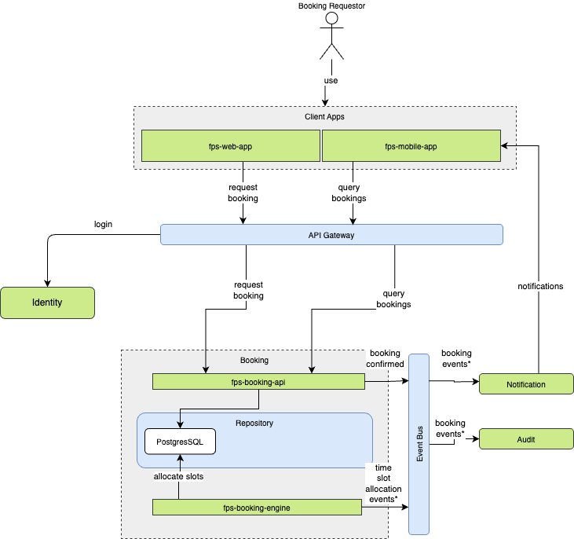
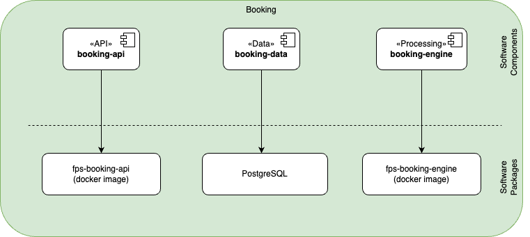

The Booking module handles parking space reservations and associated processes. It operates within the technology layer, utilizing the following components:

## Technical Overview
- Microservice architecture for scalable booking management
- Real-time slot availability tracking
- Integration with billing and authentication services

## Core Components
- **Booking Engine**: Handles reservation logic and slot management
- **State Management**: Tracks booking statuses and slot availability
- **Queue System**: Manages concurrent booking requests
- **Notification Service**: Sends booking confirmations and updates

## Integration Points
- Connects with billing system for payment processing
- Interfaces with user authentication for secure bookings
- Links to IoT systems for physical slot monitoring

## Software Components

| Software Component | Type | Purpose | Technology |
|-------------------|------|----------|------------|
| booking-api | API | External interface to manage bookings | Web API (REST) |
| booking-data | Data | Data access and persistence | Relational DB |
| booking-engine | Processing | Handles booking allocations and queue processing | Web API |

### API Functions

| Function | Endpoint | Method | Description | Status |
|----------|----------|--------|-------------|--------|
| Submit Booking Request | `/api/bookings` | `POST` | Collects booking requests from users | Implemented |
| Get Booking Status | `/api/bookings/status` | `GET` | Retrieves the status of a user's booking request | Implemented |
| Cancel Booking | `/api/bookings/cancel` | `POST` | Allows users to cancel their booking requests | Implemented |
| Get Available Slots | `/api/bookings/available-slots` | `GET` | Retrieves available parking slots for a given time frame | Implemented |
| Confirm Slot Usage | `/api/bookings/confirm-usage` | `POST` | Confirms the usage of an allocated parking slot | Optional |
| Get User Booking History | `/api/bookings/history` | `POST` | Retrieves the booking history of a user | Implemented |

## Packaging

