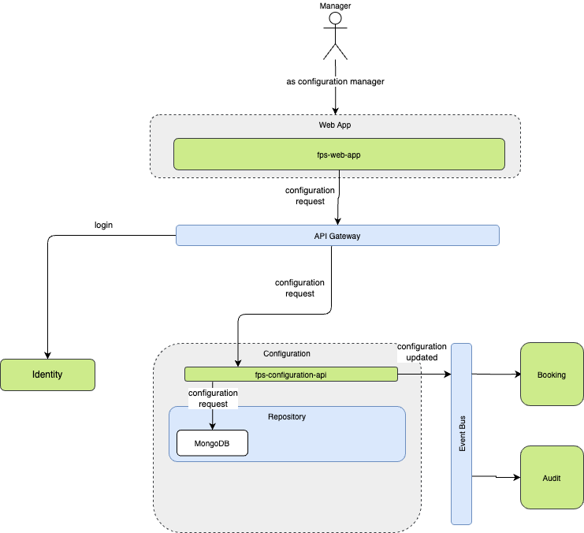
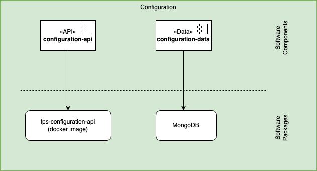

The Configuration component is responsible for managing and maintaining the various configurations required by the system, particularly focusing on garage and parking slot maintenance, configuration, and time slots availability. It ensures that all components have access to the necessary settings and parameters to function correctly.

## REST API Endpoints

| Endpoint | Method | Description | Response | Status |
|----------|--------|-------------|----------|---------|
| `/api/config/system` | GET | Manage system-wide configurations | JSON object with system settings | 200 OK |
| `/api/config/system` | PUT | Update system-wide configurations | JSON object with system settings | 200 OK, 400 Bad Request |
| `/api/config/parking` | GET | Retrieve parking lot settings | JSON object with parking configuration | 200 OK |
| `/api/config/parking` | PUT | Update parking lot settings | JSON object with parking configuration | 200 OK, 404 Not Found |
| `/api/config/integrations` | GET | List third-party integrations | Array of integration objects | 200 OK |
| `/api/config/integrations` | POST | Create new integration | Integration object | 201 Created |
| `/api/config/integrations` | DELETE | Remove integration | None | 200 OK, 404 Not Found |
| `/api/config/localization` | GET | Retrieve language settings | JSON object with language settings | 200 OK |
| `/api/config/localization` | PUT | Update language settings | JSON object with language settings | 200 OK, 400 Bad Request |

## Software Components

| Software Component | Type | Purpose | Technology |
|-------------------|------|----------|------------|
| configuration-api | API | External interface for configuration setup | Web API (REST) |
| configuration-data | Data | Data access and persistence | Document DB |

## Service Exchanges

| Interface           | Consumer   | Producer   | No. of calls / day | Auth. method | Type / Protocol   | Comments |
|---------------------|------------|------------|--------------------|--------------|-------------------|----------|
| User Authentication | Consumer 1 | Producer 1 | 1000               | OAuth 2.0    | REST / HTTPS      |          |
| Interface 2         | Consumer 2 | Producer 2 | 500                | API Key      | SOAP / HTTPS      |          |
| Interface 3         | Consumer 3 | Producer 3 | 2000               | JWT          | GraphQL / HTTPS   |          |

## Message Exchanges

| Message Type       | Sender     | Receiver   | Frequency           | Format       | Protocol         | Comments |
|--------------------|------------|------------|---------------------|--------------|------------------|----------|
| Event Notification | Service A  | Service B  | Real-time           | JSON         | WebSocket        |          |
| Data Sync          | Service C  | Service D  | Every 5 minutes     | XML          | AMQP             |          |
| Alert Message      | Service E  | Service F  | On Event            | Plain Text   | MQTT             |          |

## File Exchanges

| File Name          | Source      | Destination | Frequency          | Format       | Transfer Method | Comments |
|--------------------|-------------|-------------|--------------------|--------------|-----------------|----------|
| User Data Export   | System A    | System B    | Daily              | CSV          | SFTP            |          |
| Transaction Logs   | System C    | System D    | Hourly             | JSON         | FTP             |          |
| Backup Archives    | System E    | System F    | Weekly             | ZIP          | HTTPS           |          |

## Packaging

