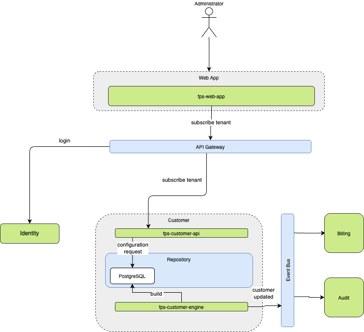
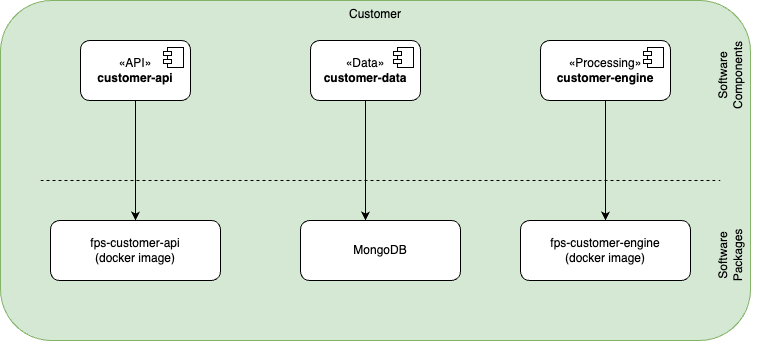

The Customer component is responsible for managing customers in a multi-tenant application. A multi-tenant application is one where a single instance of the software serves multiple customers (tenants), each with their own isolated data and configurations.

## REST API Endpoints

### Customer Management

| Endpoint | Method | Purpose | Response | Status |
|----------|--------|---------|----------|---------|
| `/api/customers` | POST | Create a new customer | Customer object | 201 Created |
| `/api/customers/{id}` | GET | Retrieve customer details | Customer object | 200 OK |
| `/api/customers/{id}` | PUT | Update customer information | Customer object | 200 OK |
| `/api/customers/{id}` | DELETE | Delete a customer | None | 204 No Content |
| `/api/customers` | GET | List all customers (with pagination) | Array of customers | 200 OK |

### User Management

| Endpoint | Method | Purpose | Response | Status |
|----------|--------|---------|----------|---------|
| `/api/customers/{id}/users` | POST | Add user to customer | User object | 201 Created |
| `/api/customers/{id}/users` | GET | List customer users | Array of users | 200 OK |
| `/api/customers/{id}/users/{userId}` | DELETE | Remove user from customer | None | 204 No Content |

### Subscription & Billing

| Endpoint | Method | Purpose | Response | Status |
|----------|--------|---------|----------|---------|
| `/api/customers/{id}/subscription` | GET | Get subscription details | Subscription object | 200 OK |
| `/api/customers/{id}/subscription` | PUT | Update subscription | Subscription object | 200 OK |
| `/api/customers/{id}/invoices` | GET | List customer invoices | Array of invoices | 200 OK |
| `/api/customers/{id}/payment-methods` | GET | List payment methods | Array of payment methods | 200 OK |

### Settings

| Endpoint | Method | Purpose | Response | Status |
|----------|--------|---------|----------|---------|
| `/api/customers/{id}/settings` | GET | Get customer settings | Settings object | 200 OK |
| `/api/customers/{id}/settings` | PUT | Update customer settings | Settings object | 200 OK |

## Software Components

| Software Component | Type | Purpose | Technology |
|-------------------|------|----------|------------|
| customer-api | API | External interface for customer operations | .NET Web API (REST) |
| customer-data | Data | Customer data access and persistence | Document DB |
| customer-engine | Service | Customer data processing | .NET Web API |

## Service Exchanges

| Interface           | Consumer   | Producer   | No. of calls / day | Auth. method | Type / Protocol   | Comments |
|---------------------|------------|------------|--------------------|--------------|-------------------|----------|
| User Authentication | Customer UI | Auth Service | 1000               | OAuth 2.0    | REST / HTTPS      | Handles user login and token generation |
| Customer Data Sync  | Customer Service | Data Service | 500                | API Key      | REST / HTTPS      | Synchronizes customer data across services |
| Notification Service| Notification UI | Notification Service | 2000               | JWT          | WebSocket / HTTPS | Real-time notifications to customers |

## Message Exchanges

| Message Type       | Sender     | Receiver   | Frequency           | Format       | Protocol         | Comments |
|--------------------|------------|------------|---------------------|--------------|------------------|----------|
| Customer Update    | Customer Service | Data Service | Real-time           | JSON         | WebSocket        | Updates customer information in real-time |
| Data Sync          | Customer Service | Analytics Service | Every 5 minutes     | XML          | AMQP             | Syncs customer data for analytics |
| Alert Notification | Alert Service | Customer UI | On Event            | Plain Text   | MQTT             | Sends alerts to customer interface |

## File Exchanges

| File Name          | Source      | Destination | Frequency          | Format       | Transfer Method | Comments |
|--------------------|-------------|-------------|--------------------|--------------|-----------------|----------|
| Customer Data Export | Customer Service | Backup Service | Daily              | CSV          | SFTP            | Daily backup of customer data |
| Transaction Logs   | Customer Service | Logging Service | Hourly             | JSON         | FTP             | Logs customer transactions |
| Backup Archives    | Backup Service | Storage Service | Weekly             | ZIP          | HTTPS           | Weekly backup archives |

## Packaging

