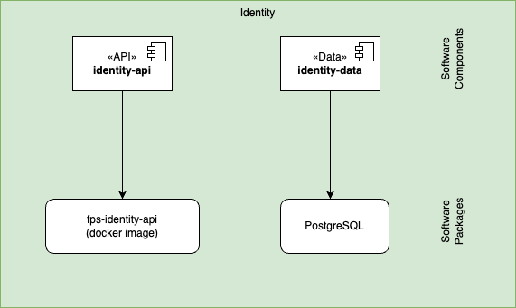

The Identity module is responsible for managing authentication and authorization within the FPS system. It handles user authentication, access control, and security-related functionality to ensure secure access to system resources.

## Software Components

| Software Component | Type | Purpose | Technology |
|-------------------|------|----------|------------|
| identity-api | API | External interface for configuration setup | Web API (REST) |
| identity-data | Data | Data access and persistence | Relational DB |

## Service Exchanges

| Interface | Consumer | Producer | No. of calls / day | Identity. method | Type / Protocol | Comments |
|-----------|----------|----------|-------------------|--------------|-----------------|-----------|
| User Authentication | Consumer 1 | Producer 1 | 1000               | OAuth 2.0    | REST / HTTPS      |          |
| Interface 2         | Consumer 2 | Producer 2 | 500                | API Key      | SOAP / HTTPS      |          |
| Interface 3         | Consumer 3 | Producer 3 | 2000               | JWT          | GraphQL / HTTPS   |          |

## Message Exchanges

| Message Type | Sender | Receiver | Frequency | Format | Protocol | Comments |
|--------------|--------|----------|-----------|---------|----------|----------|
| Event Notification | Service A  | Service B  | Real-time           | JSON         | WebSocket        |          |
| Data Sync          | Service C  | Service D  | Every 5 minutes     | XML          | AMQP             |          |
| Alert Message      | Service E  | Service F  | On Event            | Plain Text   | MQTT             |          |

## File Exchanges

| File Name | Source | Destination | Frequency | Format | Transfer Method | Comments |
|-----------|--------|-------------|-----------|--------|-----------------|----------|
| User Data Export   | System A    | System B    | Daily              | CSV          | SFTP            |          |
| Transaction Logs   | System C    | System D    | Hourly             | JSON         | FTP             |          |
| Backup Archives    | System E    | System F    | Weekly             | ZIP          | HTTPS           |          |

## REST API Endpoints

| Endpoint | Method | Description | Response | Status |
|----------|--------|-------------|----------|---------|
| `/api/identity/login` | POST | Authenticate user credentials and return session token | JWT Token | 200, 401 |
| `/api/identity/logout` | POST | Invalidate current session | Success message | 200, 401 |
| `/api/identity/refresh` | POST | Refresh authentication token | New JWT Token | 200, 401 |
| `/api/identity/session` | GET | Get current session info | Session details | 200, 401 |
| `/api/identity/session/{sessionId}` | DELETE | Terminate specific session | Success message | 200, 401, 404 |
| `/api/identity/permissions` | GET | List user permissions | Permissions array | 200, 401 |
| `/api/identity/permissions/check` | POST | Validate access to resource | Boolean result | 200, 401, 403 |
| `/api/identity/permissions/revoke` | POST | Remove user access rights | Success message | 200, 401, 403 |

All endpoints return appropriate HTTP status codes and follow REST conventions. Authentication is required for all endpoints except `/api/identity/login`.

## Packaging

The Identity module is packaged as a separate service with its own API endpoints and database access. It is deployed independently to ensure scalability and security isolation.

