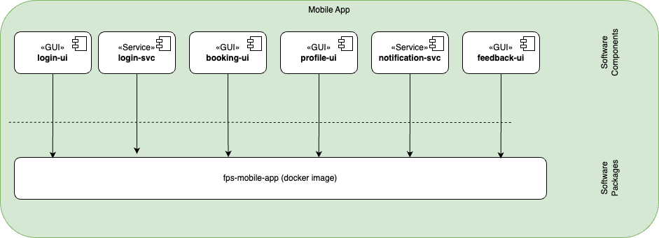

The mobile application uses React Native with Expo managed workflow. Early mobile work should avoid native project generation and app-store packaging until the product flows and API contracts are stable.

Current checked-in baseline: React Native `0.81.5`, Expo SDK `54.0.33`, React `19.1.0`, TypeScript `5.9.x`.

## Key Components

- [Identity](./identity)
- [Booking](./booking)
- [Profile](./profile)
- [Notification](./notification)
- [Feedback](./feedback)

## Implementation Baseline

| Concern | Decision |
| --- | --- |
| Framework | React Native 0.81.5 + Expo SDK 54 managed workflow |
| Language | TypeScript |
| Repository path | `code/mobile/fps-mobile` |
| API contract | Generated types from `code/clients/typescript` |
| Auth in MOB001 | Development-only bearer token handoff; production login is later |
| Implemented mobile slices | `MOB001` app shell and `MOB002` read-only My Bookings |
| Planned auth slice | `MOB003` real login through OIDC Authorization Code + PKCE using Expo-compatible browser auth |
| Native projects | Do not commit generated `ios/` or `android/` directories until a native-build slice explicitly requires them |
| Validation | Mobile TypeScript typecheck is wired into CI |

## Authentication Baseline

MOB003 should use an Expo managed-workflow-compatible OIDC Authorization Code + PKCE flow. Runtime configuration must provide the API base URL, issuer/discovery or authorization endpoints, client ID, scopes, and redirect URI. No client secret is stored in the app.

After login, the app validates the session through `GET /me` and uses the returned identity only for display and shell state. Employee API authorization remains backend-owned: services resolve tenant, user, and roles from authenticated token claims.

## Packaging

| Software Component | Type | Purpose |
|------------------- | ---- | ------- |
| login-ui | GUI | User interface for authentication |
| login-svc | Service | Authentication service |
| booking-ui | GUI | User interface for bookings |
| profile-ui | GUI | User interface for profile management |
| notification-svc | Service | Handles push notifications |
| feedback-ui | GUI | User interface for feedback |
