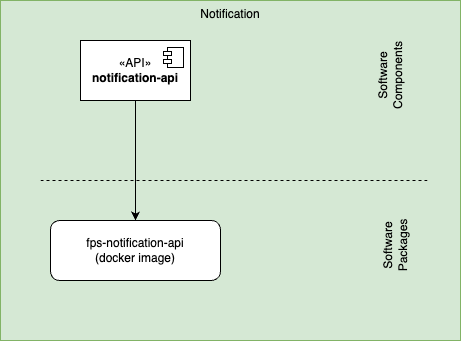

This Notification component provides functionalities to manage and display notifications to the user.

## REST API Endpoints

| Endpoint | Method | Description | Request | Response |
|----------|--------|-------------|----------|-----------|
| `/api/notifications` | POST | Creates a new notification | NotificationRequest object | 201 Created with NotificationId |
| `/api/notifications` | GET | Retrieves all notifications for the authenticated user | - | Array of Notification objects |
| `/api/notifications/{id}` | GET | Retrieves a specific notification | id (notification identifier) | Notification object |
| `/api/notifications/{id}` | PUT | Updates notification status | id (path), NotificationStatus object (body) | 200 OK |
| `/api/notifications/{id}` | DELETE | Deletes a notification | id (notification identifier) | 204 No Content |

## Software Components

| Software Component | Type | Purpose | Technology |
|-------------------|------|----------|------------|
| notification-api | API | External interface for notifications setup | Web API (REST) |

## Packaging

