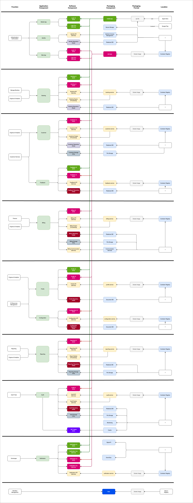

# Software Packaging



## Shared Open-Core Packages

FairSpot exposes the shared packages below so the private `fairspot-platform` repository can consume open-core contracts without vendoring `fairspot/code/**`.

| Package | Source | Published to | Notes |
| --- | --- | --- | --- |
| `FairSpot.SharedKernel` | `code/server/Shared/FPS.SharedKernel` | GitHub Packages NuGet | Shared identity, claims, role, and cross-cutting server primitives. |
| `@robertvejvoda/fairspot-api-client` | `code/clients/typescript` | GitHub Packages npm | Generated customer/tenant API types only; no platform-plane endpoints. |
| `@robertvejvoda/fairspot-ui` | `code/clients/ui` | GitHub Packages npm | Neutral React UI primitives only; no hosted operator-console UI. |

In-repo web and mobile apps continue to consume the npm packages through `file:` dependencies plus TypeScript/Vite source aliases. That keeps local development fast and avoids requiring a package publish before every open-core app change.

Private repositories must consume the npm packages from GitHub Packages:

```ini
@robertvejvoda:registry=https://npm.pkg.github.com
//npm.pkg.github.com/:_authToken=${NPM_TOKEN}
```

The private CI token must have package read access for `RobertVejvoda/fairspot`. The public publish workflow uses the repository `GITHUB_TOKEN` with `packages: write`; it does not require a private-platform secret.

Package validation and publishing are handled by `.github/workflows/publish-packages.yml`:

- pull requests dry-run-pack the SharedKernel NuGet package and both npm packages;
- manual `workflow_dispatch` with `dry_run: true` packs only;
- manual `workflow_dispatch` with `dry_run: false` publishes the packages to GitHub Packages.
