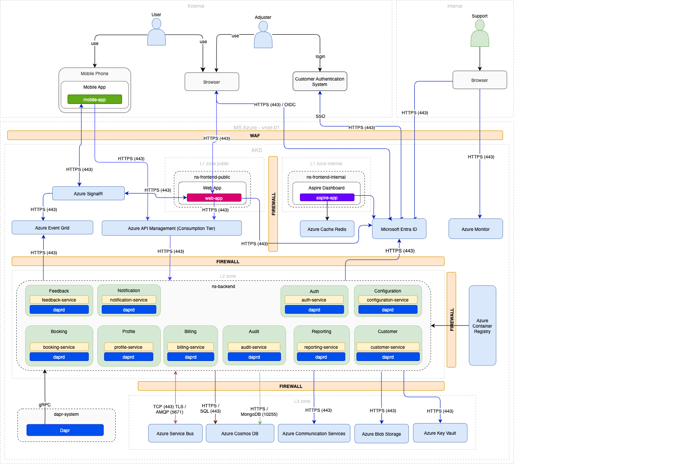

### MS Azure

The most expensive component in the Azure services list is **Azure APIM** with an estimated price of ~$48.00 per month. A cheaper alternative could be **Azure API Management Consumption Tier**, which provides basic API management at a lower cost.

| Service                         | Description / Purpose | Minimum Configuration | Estimated Price (per month) |
| ------------------------------- | --------------------- | --------------------- | --------------------------- |
| Entra ID                        | Identity and access management service for secure access to resources | Free Tier | Free |
| Azure Kubernetes Service (AKS)  | Managed Kubernetes service for running containerized applications | 1 node, Standard_B2s | ~$33.58 |
| Azure Monitor                   | Full-stack monitoring service for applications and infrastructure | 5 GB data ingestion | ~$24.24 |
| Azure API Management (Consumption Tier) | API Management service for publishing, securing, and analyzing APIs | Consumption Tier | ~$4.00 |
| Azure Cosmos DB (No-SQL)        | Globally distributed, multi-model database service | 400 RU/s, 5 GB storage | ~$24.00 |
| Azure Cosmos DB (Postgres)      | Fully managed PostgreSQL database service with horizontal scaling | Basic Tier, 1 vCore, 5 GB storage | ~$15.00 |
| Azure Event Grid                | Event routing service for building event-driven architectures | 100,000 operations | ~$0.60 |
| Azure SignalR                   | Real-time messaging service for web applications | Free Tier | Free |
| Azure Communication Service     | Communication APIs for voice, video, chat, and SMS | Pay-as-you-go | Varies |
| Azure Key Vault                 | Securely store and manage sensitive information such as keys, secrets, and certificates | Standard Tier | ~$4.00 |
| Azure Storage Accounts (Block Blob Storage) | Scalable object storage for unstructured data such as text or binary data | 100 GB, LRS | ~$2.30 |
| Azure DevOps                    | Development collaboration tools including CI/CD pipelines, repositories, and project management | Free Tier | Free |
| Azure Virtual Network (VNet)    | Provides an isolated and secure network for your Azure resources | Basic configuration | ~$0.00 (included with other services) |
| Azure Load Balancer             | Distributes incoming network traffic across multiple VMs | Basic SKU | ~$18.00 |
| Azure Backup                    | Backup service for protecting data and applications | 100 GB | ~$5.00 |
| Azure Traffic Manager           | DNS-based traffic load balancer | Basic configuration | ~$0.54 per million queries |
| Azure Network Security Group (NSG) | Basic network security service | Basic configuration | ~$0.00 (included with other services) |
| Azure Application Gateway       | Web traffic load balancer | Basic configuration | ~$22.00 |
| Azure DNS                       | DNS domain hosting service | Basic configuration | ~$0.50 per hosted zone |
| Azure Web Application Firewall (WAF) | Protects web applications from common web exploits | Basic configuration | ~$5.00 |

**Total Estimated Price (Azure):** ~$162.76
