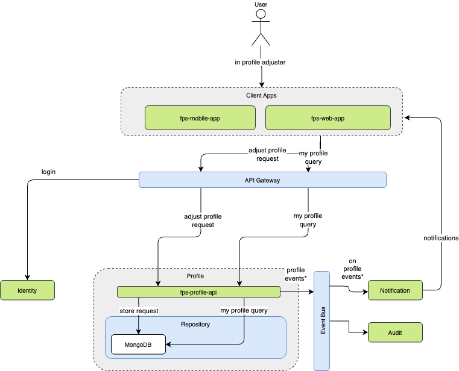
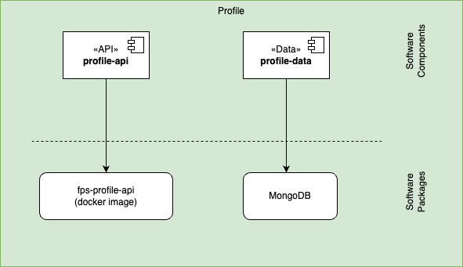

The Profile component is responsible for managing user-specific data within the system. This includes handling user preferences, vehicle information, token management, and maintenance activities. The service ensures that all user-related data is stored securely and is easily accessible for other system components.

## REST API Endpoints

| Endpoint | Method | Description | Status |
|----------|--------|-------------|--------|
| `/api/profile/{userId}` | GET | Retrieves user profile information | 200 OK |
| `/api/profile/{userId}` | PUT | Updates user profile details | 200 OK |
| `/api/profile/{userId}/vehicles` | GET | Lists all vehicles associated with user | 200 OK |
| `/api/profile/{userId}/vehicles` | POST | Adds a new vehicle to user profile | 201 Created |
| `/api/profile/{userId}/vehicles/{vehicleId}` | PUT | Updates vehicle information | 200 OK |
| `/api/profile/{userId}/vehicles/{vehicleId}` | DELETE | Removes a vehicle from profile | 204 No Content |
| `/api/profile/{userId}/sessions` | GET | Lists active user sessions | 200 OK |
| `/api/profile/{userId}/sessions/{sessionId}` | DELETE | Terminates specific session | 204 No Content |
| `/api/profile/{userId}/notifications` | POST | Updates notification preferences | 200 OK |

## Software Components

| Software Component | Type | Purpose | Technology |
|-------------------|------|----------|------------|
| profile-api | API | External interface for user profile operations | Web API (REST) |
| profile-data | Data | User profile data access and persistence | Document DB |

## Packaging

