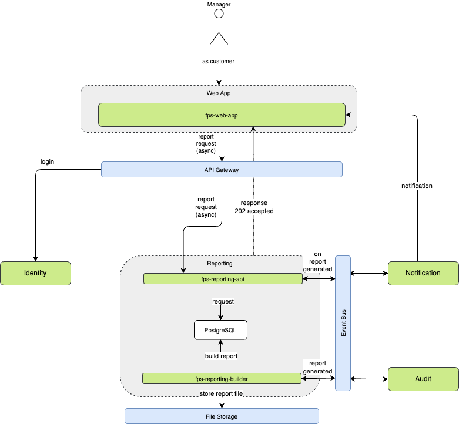
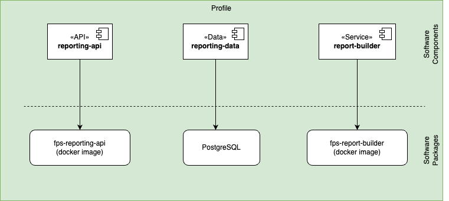

The Reporting component is a simple service that provides a predefined set of reports. It allows users to access and generate standard reports without the need for custom report creation.

## REST API Endpoints

| Endpoint | Method | Purpose | Status |
|----------|--------|---------|--------|
| `/api/reports/{reportType}` | GET | Generates standard reports based on type (occupancy, revenue, system, backup, historical, violation) | 200 OK |
| `/api/reports/live/occupancy` | GET | Provides current occupancy statistics and live sensor data | 200 OK |
| `/api/reports/revenue/{timeframe}` | GET | Retrieves revenue reports for specified timeframes (daily, weekly, monthly) | 200 OK |
| `/api/reports/system/health` | GET | Returns system health metrics | 200 OK |
| `/api/reports/system/errors` | GET | Returns system error logs | 200 OK |
| `/api/reports/historical/{startDate}/{endDate}` | GET | Fetches historical data within specified date range | 200 OK |
| `/api/reports/activity/violations` | GET | Retrieves violation records | 200 OK |
| `/api/reports/activity/users` | GET | Retrieves user activity data | 200 OK |

## Software Components

| Software Component | Type | Purpose | Technology |
|-------------------|------|----------|------------|
| reporting-api | API | External interface for reporting operations | Web API (REST) |
| reporting-data | Data | Reports data access and persistence | Relational DB |
| report-builder | Service | Reports data processing | Web API |

## Packaging

