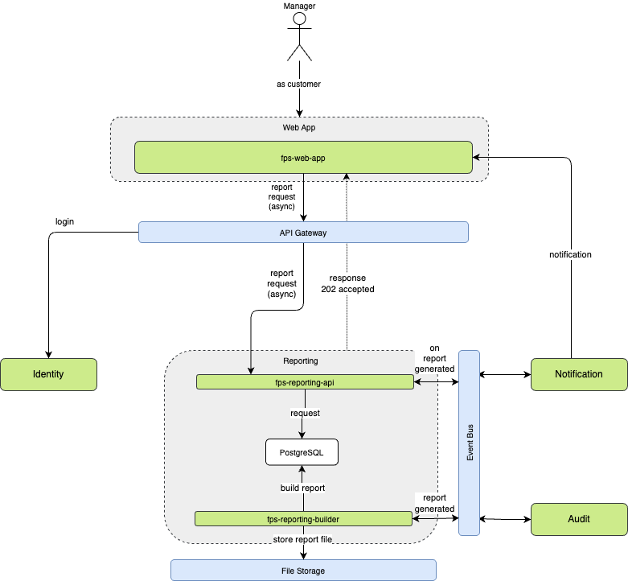
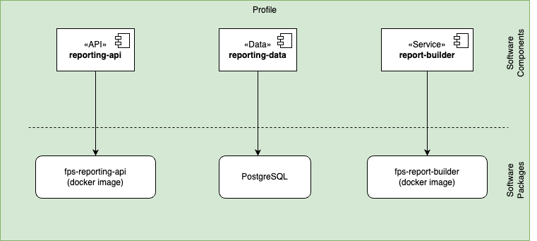

# Reporting Technology

The Reporting component stores tenant-scoped parking reporting projections and exposes predefined report APIs. It receives Booking events, updates read models, and serves manager-safe aggregate views and CSV exports.

## REST API Endpoints

Implemented endpoints:

| Endpoint | Method | Purpose |
| --- | --- | --- |
| `/reports/parking/summary` | GET | Tenant-scoped parking summary read model. |
| `/reports/parking/fairness` | GET | Tenant-scoped fairness metrics. |
| `/reports/parking/dashboard` | GET | Dashboard aggregate response for the web reporting page. |
| `/reports/parking/summary.csv` | GET | Deterministic CSV export for approved summary data. |

Planned operational report endpoints should stay under `/reports/parking/*` and use explicit report names rather than a generic report builder endpoint.

Candidate future endpoints:

| Endpoint | Method | Purpose |
| --- | --- | --- |
| `/reports/parking/utilization` | GET | Location and slot/capability utilization report. |
| `/reports/parking/reasons` | GET | Rejection, cancellation, no-show, and expiry reason-code report. |
| `/reports/parking/outcomes.csv` | GET | Manager-safe allocation outcome export. |

## Software Components

| Software Component | Type | Purpose | Technology |
| --- | --- | --- | --- |
| reporting-api | API | External interface for manager-safe reporting operations. | ASP.NET Core Web API |
| reporting-read-model | Data | Tenant-scoped parking summary, fairness, utilization, and reason-code projections. | MongoDB/read-store profile |
| reporting-projector | Service | Consumes Booking events and updates reporting projections. | Dapr pub/sub consumer |
| csv-exporter | Service | Builds deterministic privacy-safe CSV output. | .NET application service |

## Data And Privacy

- Reporting read models are tenant-scoped.
- Collection naming follows the repository tenant-isolation decision.
- CSV output must be deterministic and formula-injection safe.
- Hidden lottery internals, raw audit payloads, secrets, and unrelated employee-private data must not be returned by reporting endpoints.

## Packaging

