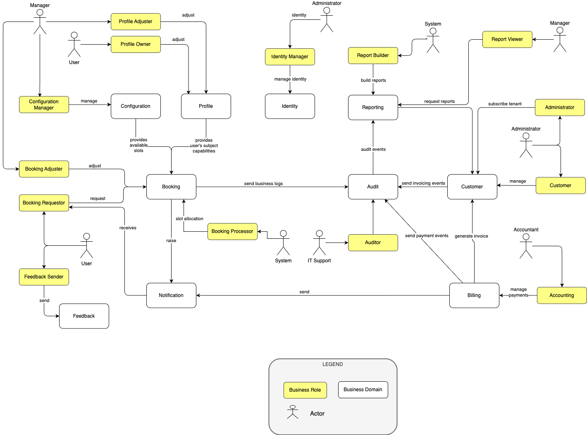

# Software Architecture

## Architecture Overview

FPS is a multi-tenant, event-driven application platform for fair allocation of scarce company resources, with parking as the first product domain. The system is organised as independently deployable services around bounded business contexts. Dapr provides the provider-neutral boundary for sidecar-based service integration, pub/sub, state access, health checks, secrets, and future workflow orchestration.

This page intentionally describes provider-neutral architecture. Local, demo, Azure, AWS, Kubernetes, and client-owned production variants are deployment profiles under [Production](../production), not core architecture decisions.

Each backend service follows the same high-level shape:

- API layer for HTTP endpoints and Dapr subscriptions;
- Application layer for commands, queries, handlers, and cross-service ports;
- Domain layer for aggregates, value objects, and business rules;
- Infrastructure layer for persistence, Dapr clients, HTTP clients, and adapters.

Current implementation work is documentation-led and proceeds through vertical slices in [Development Plan](../development-plan). Booking, mobile, web/admin, tenant onboarding, reporting, audit, notification, and local harness slices are implemented for the current evaluation baseline. Some infrastructure adapters remain smoke/evaluation-grade and are called out below.

## Context Boundaries

| Context | Responsibility | Current integration role |
| --- | --- | --- |
| Identity | Authenticated user context, roles, and `GET /me`. | JWT claim mapping for tenant, user, and roles. |
| Booking | Parking request lifecycle, draw/allocation decisions, cancellation, usage, and booking history. | Core source of Booking events. |
| Profile | Employee parking eligibility, vehicle facts, company-car and accessibility entitlements. | Booking consumes immutable Profile snapshots. |
| Notification | User-visible notification records and later channels. | Consumes Booking events and stores idempotent in-app records; email delivery is still a local/stub adapter. |
| Audit | Append-only, pseudonymised trace of Booking events. | Consumes Booking events and stores audit records; persistence is still in-memory for the evaluation baseline. |
| Configuration | Tenant/location parking policy and slot/capacity inputs. | Booking consumes policy and capacity contracts. |
| Customer | Tenant ownership and onboarding. | Defines tenant boundaries, lifecycle, identity setup, parking bootstrap, readiness checks, and future provisioning. |
| Reporting | Materialised read models and analytics. | Consumes Booking events/read models without driving Booking state; persistence is still in-memory for the evaluation baseline. |
| Billing | Deferred commercial account capability. | Future contract/support records only after commercial approval. |
| Feedback | Deferred feedback capability. | Documented as a future/support capability; no service exists in the current implementation baseline. |

Boundary rules are defined in [Booking Context Contract](../business-layer/booking-context-contract), [Booking Event Contracts](../business-layer/booking-event-contracts), and [Booking Authorization](../business-layer/booking-authorization).

## Application Components

| App. Component | Name | Technology |
|------------------- | ---- | ------- |
| [Web App](./web-app) | Web App | React |
| [Mobile App](./mobile-app) | Mobile App | React Native 0.81.5 + Expo SDK 54 |
| [Identity](./identity) | Authentication & Authorization | .NET 10 Web API |
| [Audit](./audit) | Audit Service | .NET 10 Web API |
| [Billing](./billing) | Deferred Billing Service | Future .NET 10 Web API if approved |
| [Booking](./booking) | Booking Service | .NET 10 Web API |
| [Configuration](./configuration) | Configuration Service | .NET 10 Web API |
| [Customer](./customer) | Customer Service | .NET 10 Web API |
| [Notification](./notification) | Notification Service | .NET 10 Web API |
| [Profile](./profile) | Profile Service | .NET 10 Web API |
| [Reporting](./reporting) | Reporting Service | .NET 10 Web API |
| [Feedback](./feedback) | Deferred Feedback Service | Future .NET 10 Web API if approved |

## Integration Model

| Integration | Pattern | Notes |
| --- | --- | --- |
| API access | HTTP through an ingress/API gateway | JWT-based authentication, service endpoints stay tenant-aware. Local harness currently uses Envoy; production may use Traefik, cloud-native ingress, or a client-approved gateway. |
| Service-to-service command data | Synchronous HTTP or Dapr service invocation where required for command decisions | Booking may synchronously query Configuration and Profile when required to accept/reject a command. |
| Domain outcomes | Dapr pub/sub | Booking events feed Notification, Audit, and Reporting read models. Smoke profile uses in-memory pub/sub; local durable profile uses RabbitMQ; demo/client profile selects the broker behind the same Dapr component contract. |
| Workflow/orchestration | Dapr Workflows where durability is needed | Draw workflow can be introduced when operational replay/long-running orchestration is required. |
| Write persistence | Dapr state store | Booking uses Dapr state. Smoke profile uses in-memory state; local durable and production profiles target MongoDB-compatible state with tenant-safe keys or tenant-specific collections. |
| Read persistence | Service-owned read models | Target production direction is MongoDB-compatible read models with tenant-specific collections. Several evaluation-baseline services still use in-memory repositories and need persistence adapters before production. |

Cross-domain failures follow [Booking Context Contract](../business-layer/booking-context-contract): required command inputs fail safely, while observer services such as Notification and Audit must not roll back persisted Booking state.

## Other Components

| App. Component | Software Component | Name | Technology |
|------------------- | ------------------- | ---- | ------- |
| Authentication | Keycloak | Identity and Access Management | Java |
| Traces and metrics | Prometheus | Monitoring and Alerting | Go |
| Monitoring | Grafana | Analytics and Monitoring | Various |
| Logging | Loki | Log Aggregation | Go |
| Tracing | Jaeger | Distributed Tracing | Go |
| Write store (CQRS) | Dapr state store | Aggregate persistence behind a swappable component contract | Dapr-compatible provider |
| Read store (CQRS) | Service-owned read model store | Query/projection read models; production target is MongoDB-compatible storage | Provider-neutral |
| Event Bus | Dapr pub/sub | Booking event delivery behind a swappable component contract | Dapr-compatible broker |
| Cache | Redis-compatible cache | Optional cache, rate limiting, and short-lived operational state | Provider-neutral |
| API Gateway | Ingress/API gateway | External routing, TLS termination, and optional rate limiting | Local Envoy, Traefik, cloud-native ingress, or client-approved equivalent |
| File Storage | S3-compatible object storage | Reports, exports, backup artifacts, and future attachments | MinIO, cloud object storage, or client-approved equivalent |
| Secret Management | Secret store | Runtime credentials and certificates behind Dapr secret-store pattern | Vault, cloud key vault, or client-approved equivalent |

> **Multi-tenancy**: each service owns its data boundary and resolves tenant scope from authenticated or trusted service context. Production persistence should use tenant-safe keys or tenant-specific collections such as `{tenantKey}_booking_requests`, with collection/key names derived centrally from a sanitised tenant key and never supplied by callers.

Collection-per-tenant impact:

- Provisioning creates tenant-specific collections/indexes or equivalent tenant-safe storage partitions instead of per-tenant service databases.
- Repository and query helpers must centralise collection-name derivation so tenant keys are sanitised consistently.
- Dapr state-store usage must either route to tenant-specific collections through a documented component strategy or use state keys that cannot cross tenants; do not mix approaches ad hoc.
- Backup, restore, retention, and support tooling must operate at collection scope when a single tenant is targeted.
- Cross-tenant analytics must explicitly enumerate allowed tenant collections and enforce authorization before aggregation.
- Database-level credentials no longer provide tenant isolation by themselves; application/service authorization and collection resolver tests become more important.

## Security

FPS security is centred on authenticated context, tenant isolation, least privilege, and traceability.

| Concern | Architecture decision |
| --- | --- |
| Identity provider | OIDC provides JWTs. Local development uses Keycloak; client production may use Keycloak, Entra ID, Okta, or another trusted IdP as long as required claims are mapped. Stable claim mapping is documented in [Versions and Decisions](../versions-and-decisions). |
| Current user context | Services resolve `tenantId`, `userId`, and roles from authenticated claims through `ICurrentUser`; request bodies, query strings, or caller-supplied identity headers must not override identity. |
| Tenant isolation | MongoDB collection-per-tenant, resolved from authenticated/service context before reads or writes. Collection names must use a sanitised tenant key and must not be caller supplied. |
| Service-to-service security | Dapr mTLS/Sentry is the platform baseline; user-context forwarding is used only where the downstream service must make a user-scoped decision. |
| Authorization | Booking authorization rules are documented in [Booking Authorization](../business-layer/booking-authorization); services must fail closed on missing required identity claims. |
| Privacy | Audit stores pseudonymised user references (`actorHash`, requestor/affected-user hashes) and must not store raw names, emails, profile private data, or raw user IDs in audit records. |
| Event safety | Booking events must not include secrets, stack traces, lottery seeds, internal weights, or private details about unrelated employees. |
| Secrets | Credentials and API keys come from a secret store through the documented Dapr/hosting boundary. Local uses Vault-compatible setup; demo/client may use Vault or platform secret stores. |
| Observability | OpenTelemetry is the portability boundary. Local uses Prometheus/Grafana/Loki/Jaeger-style tooling where configured; client production can export to approved observability platforms. |

Detailed security documentation is maintained under [Security](../security), especially [Security Model](../security/security-model), [Authentication](../security/authentication), [Authorization](../security/authorization), [Data Privacy](../security/data-privacy), [Traceability](../security/traceability), and [Microservice Security Patterns](../security/microservice-security-patterns).

### Dapr

Dapr is a design boundary, not a cloud decision. Local development can use self-hosted Dapr sidecars. Demo and client production may use managed Dapr, Kubernetes Dapr, or self-hosted sidecars as long as the same logical component names and contracts are preserved.

| Capability | Dapr responsibility | Production note |
| --- | --- | --- |
| Sidecars | Service invocation, pub/sub, state, secret access, and bindings. | Required for services that use Dapr components. |
| Component contracts | Logical names such as `fps-pubsub`, `bookingstore`, `notificationstore`, and `secretstore`. | Provider changes should not require application code changes. |
| mTLS/Sentry | Service identity and encrypted service-to-service traffic where supported. | Required for production or equivalent platform service identity must be documented. |
| Placement/workflows | Actor/workflow support when a slice needs durable orchestration. | Future workflow use remains optional until a concrete slice requires it. |
| Dashboard/operations | Runtime diagnostics and component visibility. | Optional; client tooling may replace it. |

## Licensing

FPS is licensed under AGPL-3.0-or-later. The repository license decision is recorded in [Versions and Decisions](../versions-and-decisions), and the full license text is available in the [repository LICENSE](https://github.com/RobertVejvoda/FPS/blob/master/LICENSE).

## Tool/Framework Versions

This section provides a list of tools and frameworks used in the project, along with their versions, preferred editors, programming languages, distribution formats, and licenses.

| Tool/Framework | Version | Editor | Language | Distribution Format | License | Purpose |
| ---------------| ------- | ------ | -------- | ------------------- | ------- | ------- |
| React          | 19.1.0  | VSCode | TypeScript/JavaScript | npm package | MIT | Frontend library for building user interfaces |
| React Native  | 0.81.5  | VSCode | TypeScript | npm package         | MIT     | Cross-platform mobile app framework |
| Expo          | 54.0.33 | VSCode | TypeScript | npm package         | MIT     | Managed React Native workflow — no native build tooling required |
| .NET 10        | 10.0    | VSCode | C#        | NuGet package       | MIT     | Framework for building various types of applications |
| Java           | 11      | IntelliJ| Java     | JAR file            | GPL     | General-purpose programming language |
| Docker         | Current supported local/CI version | VSCode | N/A | Docker image | Apache 2.0 | Platform for developing, shipping, and running applications in containers |
| Helm           | Optional 3.x | VSCode | N/A      | Helm chart          | Apache 2.0 | Package manager when the selected deployment profile uses Kubernetes |
| Dapr           | 1.14+   | VSCode | Various  | Docker image        | Apache 2.0  | Runtime for building distributed applications (Workflows require 1.10+) |
| Kubernetes     | Optional target provider-supported version | VSCode | YAML | Helm chart | Apache 2.0 | Deployment option when required by demo/client environment; not a core product dependency |
| Terraform      | 1.x     | VSCode | HCL      | Binary              | MPL 2.0 | Infrastructure as code tool |
| Ansible        | Future/optional | VSCode | YAML     | Package             | GPL 3.0 | Automation tool for IT tasks |
| Git            | Current contributor version | VSCode | N/A | Binary | GPL 2.0 | Version control system |
