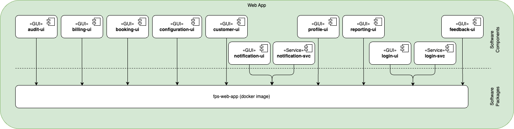

The web application follows a modular frontend architecture that separates functionality into distinct UI components while ensuring consistent deployment through Docker containerization.

## Key Components

- [Identity](./identity)
- [Booking](./booking)
- [Billing](./billing)
- [Customer](./customer)
- [Profile](./profile)
- [Configuration](./configuration)
- [Reporting](./reporting)
- [Audit](./audit)

## Packaging

| Software Component | Type | Purpose | Technology | Packaging Type | Package Name |
|------------------- | ---- | ------- | ---------- | -------------- | ------------ |
| audit-ui | GUI | User interface for managing audits | React | Docker container | fps-web-app |
| billing-ui | GUI | User interface for managing billings | React | Docker container | fps-web-app |
| booking-ui | GUI | User interface for managing bookings | React | Docker container | fps-web-app |
| configuration-ui | GUI | User interface for system configuration | React | Docker container | fps-web-app |
| customer-ui | GUI | User interface for customer management | React | Docker container | fps-web-app |
| notification-ui | GUI | User interface for managing notifications | React | Docker container | fps-web-app |
| notification-svc | Service | Service for managing notifications | React | Docker container | fps-web-app |
| profile-ui | GUI | User interface for profile management | React | Docker container | fps-web-app |
| reporting-ui | GUI | User interface for reports and analytics | React | Docker container | fps-web-app |
| feedback-ui | GUI | User interface for handling feedback | React | Docker container | fps-web-app |
| login-ui | GUI | User interface for authentication | React | Docker container | fps-web-app |
| login-svc | Service | Service for authentication | React | Docker container | fps-web-app |

