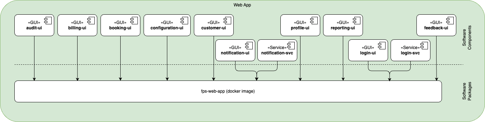

# Web App Technology

The web application follows a modular frontend architecture that separates functionality into distinct UI components while ensuring consistent deployment through Docker containerization.

## Authentication Baseline

The web app should use browser-based OIDC Authorization Code + PKCE for real employee and operator login. The selected identity provider is deployment-profile or customer specific; the app depends on standard OIDC discovery/authorization/token/logout behavior rather than a provider-specific SDK.

Runtime configuration must provide:

- API base URL;
- OIDC issuer or discovery endpoint;
- public client ID;
- scopes;
- redirect URI;
- post-logout redirect URI;
- whether the development manual-token fallback is enabled.

The browser client must not contain a client secret. Access tokens are attached only to FairSpot API calls. The app must validate the session with `GET /me` after login or restoration, and services must continue to resolve tenant/user/role context from token claims rather than web-supplied identifiers.

Manual bearer-token entry is a local smoke-testing fallback, not the default user experience for demo or production.

## Key Components

- [Identity](./identity)
- [Booking](./booking)
- [Billing](./billing)
- [Customer](./customer)
- [Profile](./profile)
- [Configuration](./configuration)
- [Reporting](./reporting)
- [Audit](./audit)

## Packaging

| Software Component | Type | Purpose | Technology | Packaging Type | Package Name |
|------------------- | ---- | ------- | ---------- | -------------- | ------------ |
| audit-ui | GUI | User interface for managing audits | React | Docker container | fps-web-app |
| billing-ui | GUI | User interface for managing billings | React | Docker container | fps-web-app |
| booking-ui | GUI | User interface for managing bookings | React | Docker container | fps-web-app |
| configuration-ui | GUI | User interface for system configuration | React | Docker container | fps-web-app |
| customer-ui | GUI | User interface for customer management | React | Docker container | fps-web-app |
| notification-ui | GUI | User interface for managing notifications | React | Docker container | fps-web-app |
| notification-svc | Service | Service for managing notifications | React | Docker container | fps-web-app |
| profile-ui | GUI | User interface for profile management | React | Docker container | fps-web-app |
| reporting-ui | GUI | User interface for reports and analytics | React | Docker container | fps-web-app |
| feedback-ui | GUI | User interface for handling feedback | React | Docker container | fps-web-app |
| login-ui | GUI | User interface for authentication | React | Docker container | fps-web-app |
| login-svc | Service | Service for authentication | React | Docker container | fps-web-app |
